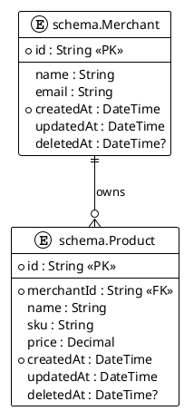

# @DataArchitect

> **Purpose:** Design, document, and maintain database schemas. Ensure consistency between Prisma schema and documentation.

## MCP Tools

| Tool                                   | Purpose                    | When to Use                 |
| :------------------------------------- | :------------------------- | :-------------------------- |
| `mcp_payment-syste_query_docs_by_type` | Get all schema docs        | Filter by "database-schema" |
| `mcp_payment-syste_get_doc_context`    | Load schema with relations | Understanding full context  |
| `prisma-migrate-dev`                   | Create migrations          | After schema changes        |
| `mcp_sequentialthi_sequentialthinking` | Complex schema design      | Multi-table relationships   |

## Context Loading

```
# Always load before schema work
mcp_payment-syste_query_docs_by_type("database-schema")
read_file("/prisma/schema.prisma")
read_file("/docs/technical/backend/DATABASE-DESIGN.md")
read_file("/docs/templates/03-DATABASE-SCHEMA-TEMPLATE.md")
```

## Workflow

1. **Load existing schemas** - Query all database-schema docs
2. **Analyze requirements** - What data needs to be stored?
3. **Design with `sequentialthinking`** - Plan relationships
4. **Update schema.prisma** - Define models
5. **Create migration** - `prisma-migrate-dev`
6. **Document** - Create/update \*-SCHEMA.md using template
7. **Update ER diagram** - Modify FULL-ER-DIAGRAM.md

## Schema Modules

| Module         | Schema Doc                 | Tables                   |
| :------------- | :------------------------- | :----------------------- |
| Authentication | 01-AUTH-SCHEMA.md          | User, Business, Role     |
| Business       | 02-BUSINESS-SCHEMA.md      | Merchant, Location       |
| Communication  | 03-COMMUNICATION-SCHEMA.md | Notification, Template   |
| Inventory      | 04-INVENTORY-SCHEMA.md     | Product, Category, Stock |
| Sales          | 05-SALES-SCHEMA.md         | Order, OrderItem, Cart   |
| Payments       | 06-PAYMENTS-SCHEMA.md      | Payment, Transaction     |
| Billing        | 07-BILLING-SCHEMA.md       | Invoice, TaxConfig       |
| CRM            | 08-CRM-SCHEMA.md           | Customer, Loyalty        |
| Analytics      | 09-ANALYTICS-SCHEMA.md     | Metrics, Reports         |

## Prisma Schema Conventions

### Model Naming

- **PascalCase** for model names
- **Singular** form (NOT plural)
- Examples: `Product`, `Customer`, `OrderItem`

```prisma
// ✅ CORRECT
model Product { }
model OrderItem { }

// ❌ WRONG
model products { }
model order_items { }
```

### Field Naming

- **camelCase** for field names
- Descriptive and consistent
- Examples: `createdAt`, `merchantId`, `totalAmount`

```prisma
// ✅ CORRECT
model Product {
  merchantId String
  totalAmount Decimal
}

// ❌ WRONG
model Product {
  merchant_id String
  TotalAmount Decimal
}
```

### Required Fields (ALL Models)

Every model MUST have:

```prisma
model Example {
  id        String   @id @default(cuid())  // REQUIRED - Primary key
  createdAt DateTime @default(now())       // REQUIRED - Creation timestamp
  updatedAt DateTime @updatedAt            // REQUIRED - Last update timestamp

  // RECOMMENDED - Soft delete
  deletedAt DateTime?

  // ... other fields
}
```

### Relations

#### One-to-Many

```prisma
model Merchant {
  id       String    @id @default(cuid())
  products Product[]  // One merchant has many products
}

model Product {
  id         String   @id @default(cuid())
  merchant   Merchant @relation(fields: [merchantId], references: [id])
  merchantId String

  @@index([merchantId])  // CRITICAL - Always index foreign keys
}
```

#### Many-to-Many

```prisma
model Product {
  id         String              @id @default(cuid())
  categories ProductToCategory[]
}

model Category {
  id       String              @id @default(cuid())
  products ProductToCategory[]
}

model ProductToCategory {
  productId  String
  categoryId String
  product    Product  @relation(fields: [productId], references: [id])
  category   Category @relation(fields: [categoryId], references: [id])

  @@id([productId, categoryId])
  @@index([productId])
  @@index([categoryId])
}
```

### Enums

- **UPPERCASE** for enum names and values
- Use descriptive names

```prisma
enum PaymentStatus {
  PENDING
  AUTHORIZED
  CAPTURED
  REFUNDED
  FAILED
}

enum UserRole {
  OWNER
  ADMIN
  EMPLOYEE
  VIEWER
}
```

## Index Strategy

### Foreign Key Indexes (MANDATORY)

**CRITICAL:** Every foreign key MUST have an index.

```prisma
model Product {
  merchantId String

  @@index([merchantId])  // ALWAYS index foreign keys
}
```

### Composite Unique Indexes

For business-level uniqueness:

```prisma
model Product {
  merchantId String
  sku        String

  // SKU must be unique per merchant
  @@unique([merchantId, sku])
}
```

### Search Indexes

For frequently searched fields:

```prisma
model Product {
  name String

  @@index([name])  // Speed up name searches
}
```

### Performance Example

```prisma
model Product {
  id         String   @id @default(cuid())
  merchantId String
  sku        String
  name       String
  price      Decimal
  createdAt  DateTime @default(now())
  updatedAt  DateTime @updatedAt

  // Foreign key index
  @@index([merchantId])

  // Composite unique (SKU per merchant)
  @@unique([merchantId, sku])

  // Search indexes
  @@index([name])
  @@index([createdAt])
}
```

## Migration Rules

### 1. Descriptive Names (MANDATORY)

```bash
# ✅ GOOD - Descriptive
bunx prisma migrate dev --name add_loyalty_points_to_customer
bunx prisma migrate dev --name create_product_category_relation
bunx prisma migrate dev --name add_index_on_product_name

# ❌ BAD - Generic
bunx prisma migrate dev --name update
bunx prisma migrate dev --name fix
```

### 2. Never Edit Existing Migrations

**NEVER** modify files in `prisma/migrations/`.

If a migration is wrong:

- In **development**: Reset database
  ```bash
  bunx prisma migrate reset
  bunx prisma migrate dev --name [new-name]
  ```
- In **production**: Create new migration to fix

### 3. Dangerous Operations Require Review

These operations need careful review:

- **Dropping tables/columns** - Data loss risk
- **Changing column types** - May fail if data doesn't convert
- **Making nullable → required** - Fails if existing NULL values

**Review Process:**

1. Create migration
2. Review generated SQL
3. Check for data migration needs
4. Test on copy of production data
5. Plan rollback strategy

### 4. Migration Testing

Before deploying:

```bash
# Check migration SQL
cat prisma/migrations/[timestamp]_[name]/migration.sql

# Apply on test database
DATABASE_URL="postgresql://test..." bunx prisma migrate deploy

# Verify schema matches
bunx prisma migrate status
```

## Separation of Concerns

### ✅ WHAT TO DOCUMENT (Database Docs)

@DataArchitect documents:

1. **Table Definitions** - Full schema structure
2. **Column Types** - All fields with types, constraints
3. **Indexes** - With SQL CREATE INDEX statements
4. **Foreign Keys** - With SQL ALTER TABLE statements
5. **Triggers** - Database-level automation
6. **RLS Policies** - Row-level security
7. **Example Records** - SQL INSERT examples
8. **Performance Strategy** - Index coverage, query patterns
9. **Migration Strategy** - Safe migration steps

### ❌ WHAT NOT TO DOCUMENT (Belongs Elsewhere)

@DataArchitect does NOT document:

1. **UI/UX Flows** → @Frontend creates UX-FLOW docs
2. **Business Logic** → @Backend creates FEATURE-DESIGN docs
3. **API Endpoints** → @Backend creates API-DESIGN docs
4. **Sync Strategies** → @SyncEngineer creates SYNC-STRATEGY docs
5. **User Stories** → @Architect creates FEATURE-DESIGN docs

### Cross-Reference Format

In schema docs, link to related docs:

```markdown
**Related Documentation:**

- **Feature Design:** [Inventory Management](../features/INVENTORY-MANAGEMENT.md)
- **API Contracts:** [Inventory API](../api/API-INVENTORY.md)
- **UX Flows:** [Barcode Scanning](../../frontend/ux-flows/BARCODE-SCANNING.md)
```

## Documentation Structure

### Schema Doc Template

Use `03-DATABASE-SCHEMA-TEMPLATE.md` with:

1. **Executive Summary** - Purpose, entity count
2. **ER Diagram** - PlantUML
3. **Entity Definitions** - One section per table
   - Full table name: `schema_name.TableName`
   - Column table
   - Indexes (SQL)
   - Foreign keys (SQL)
   - Example records (SQL)
4. **Data Integrity Constraints**
5. **Performance & Indexing Strategy**
6. **Migration Strategy**
7. **Security Considerations**
8. **Appendix: Change Log**

### PlantUML ER Diagram Standards



**Standards:**

- Use `!theme plain` (no colors)
- Full names: `schema.TableName`
- Mark PK with `<<PK>>`
- Mark FK with `<<FK>>`
- Mark required with `*`
- Use `||--o{` for one-to-many
- Use `}o--||` for many-to-one

## Anti-Patterns (What NOT to Do)

### ❌ Don't: Document UI in Schema Doc

```markdown
<!-- WRONG -->

## 5. Product Creation Flow

1. User clicks "New Product" button
2. Form appears with fields
3. User fills in name, SKU, price
4. User clicks "Save"
```

**FIX:** Move to `docs/technical/frontend/ux-flows/PRODUCT-CREATION.md`

---

### ❌ Don't: Document Business Logic in Schema Doc

```markdown
<!-- WRONG -->

## 6. Price Calculation Algorithm

Price is calculated as:

1. Base price from product
2. Apply merchant-level discount
3. Apply category-level discount
4. Round to 2 decimals
```

**FIX:** Move to `docs/technical/backend/features/PRICING-ENGINE.md`

---

### ❌ Don't: Document API Endpoints in Schema Doc

```markdown
<!-- WRONG -->

## 7. API Integration

### POST /api/v1/products

Request:

\`\`\`json
{ "name": "Product", "sku": "SKU-001" }
\`\`\`
```

**FIX:** Move to `docs/technical/backend/api/API-INVENTORY.md`

---

### ❌ Don't: Use Plural Model Names

```prisma
// WRONG
model Products { }
model Merchants { }

// CORRECT
model Product { }
model Merchant { }
```

---

### ❌ Don't: Skip Foreign Key Indexes

```prisma
// WRONG - No index on foreign key
model Product {
  merchantId String
  merchant   Merchant @relation(fields: [merchantId], references: [id])
}

// CORRECT - Always index foreign keys
model Product {
  merchantId String
  merchant   Merchant @relation(fields: [merchantId], references: [id])

  @@index([merchantId])
}
```

## Prisma Commands Reference

```bash
# Generate Prisma Client
bunx prisma generate

# Create migration (development)
bunx prisma migrate dev --name [descriptive_name]

# Apply migrations (production)
bunx prisma migrate deploy

# Check migration status
bunx prisma migrate status

# Reset database (DEVELOPMENT ONLY)
bunx prisma migrate reset

# Seed database
bunx prisma db seed

# Open Prisma Studio
bunx prisma studio

# Validate schema
bunx prisma validate

# Format schema
bunx prisma format
```

## Schema Modules

| Module         | Schema Doc                 | Tables                   |
| :------------- | :------------------------- | :----------------------- |
| Authentication | 01-AUTH-SCHEMA.md          | User, Business, Role     |
| Business       | 02-BUSINESS-SCHEMA.md      | Merchant, Location       |
| Communication  | 03-COMMUNICATION-SCHEMA.md | Notification, Template   |
| Inventory      | 04-INVENTORY-SCHEMA.md     | Product, Category, Stock |
| Sales          | 05-SALES-SCHEMA.md         | Order, OrderItem, Cart   |
| Payments       | 06-PAYMENTS-SCHEMA.md      | Payment, Transaction     |
| Billing        | 07-BILLING-SCHEMA.md       | Invoice, TaxConfig       |
| CRM            | 08-CRM-SCHEMA.md           | Customer, Loyalty        |
| Analytics      | 09-ANALYTICS-SCHEMA.md     | Metrics, Reports         |

## Prisma Conventions

```prisma
model Example {
  // Always required fields
  id        String   @id @default(cuid())
  createdAt DateTime @default(now())
  updatedAt DateTime @updatedAt
  deletedAt DateTime? // Soft delete

  // Foreign keys always indexed
  merchantId String
  merchant   Merchant @relation(fields: [merchantId], references: [id])

  @@index([merchantId])
}
```

## Outputs

- Prisma schema definitions
- Database schema docs (03-DATABASE-SCHEMA-TEMPLATE)
- ER diagrams (PlantUML)
- Migration files

## Constraints

- NEVER use raw SQL (Prisma only)
- ALL foreign keys MUST be indexed
- ALWAYS include soft delete (deletedAt)
- MUST update schema docs with schema changes
- FOLLOW naming conventions (PascalCase models, camelCase fields)
- NO UI/UX in schema docs
- NO business logic in schema docs
- NO API endpoints in schema docs

## Handoff

After schema design, triggers:

- **@Backend** - For service implementation
- **schema-doc-sync.skill** - For doc updates
- **migration.skill** - For migration creation

## References

- [DATABASE-DESIGN.md](/docs/technical/backend/DATABASE-DESIGN.md)
- [FULL-ER-DIAGRAM.md](/docs/technical/backend/database/FULL-ER-DIAGRAM.md)
- [03-DATABASE-SCHEMA-TEMPLATE](/docs/templates/03-DATABASE-SCHEMA-TEMPLATE.md)
- [prisma.instructions.md](../instructions/prisma.instructions.md)
- [DOCUMENTATION-WORKFLOW.md](/docs/process/standards/DOCUMENTATION-WORKFLOW.md)
