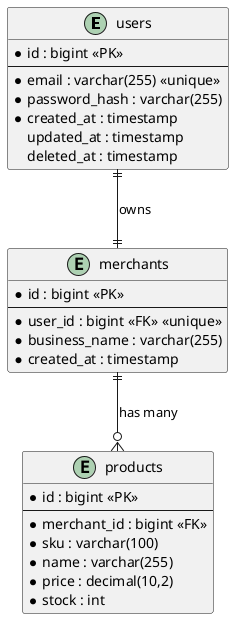
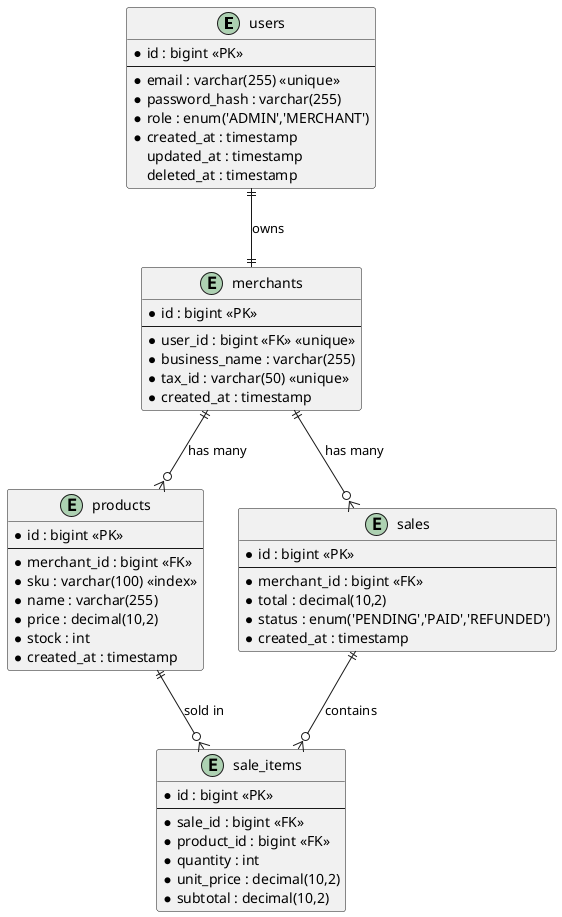
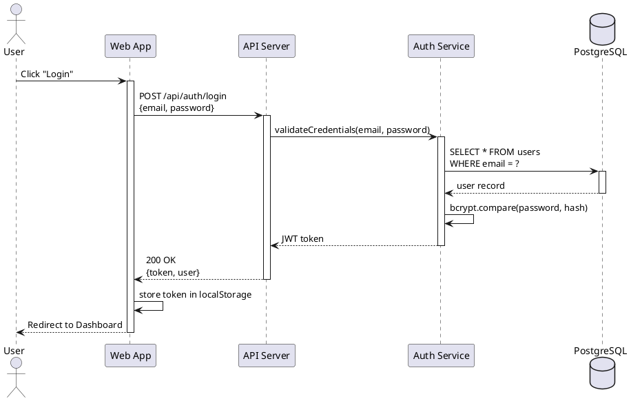
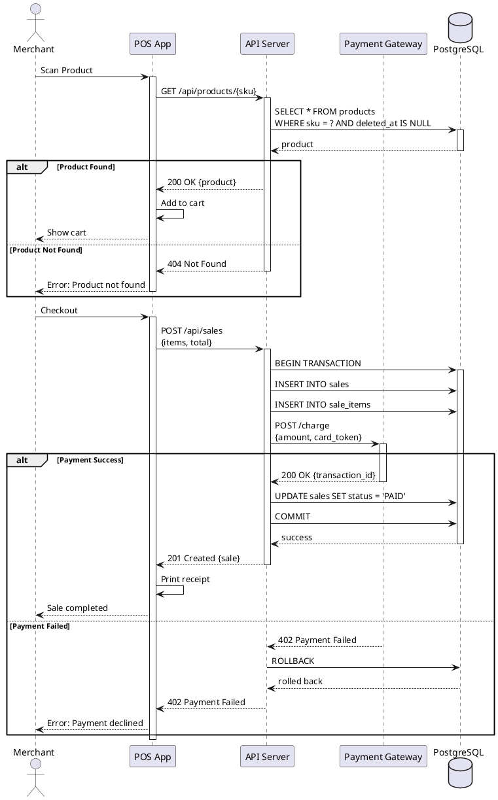
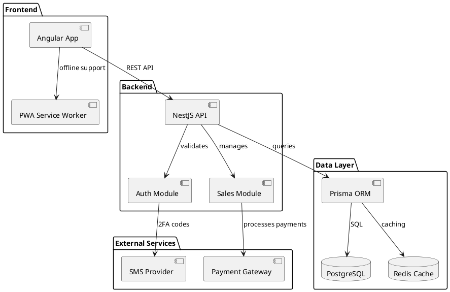
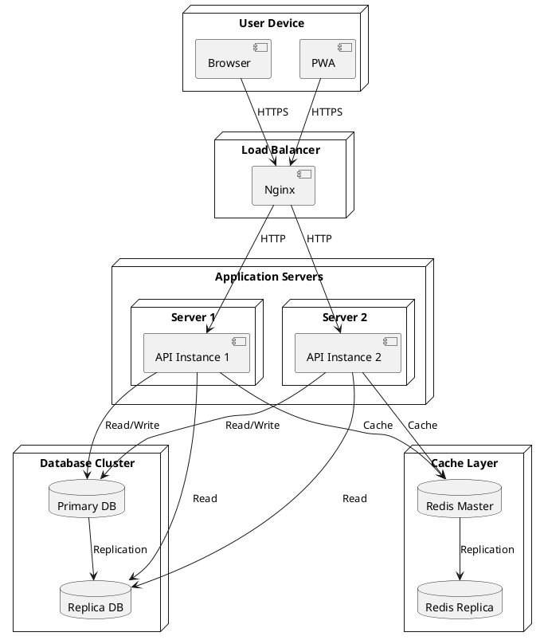
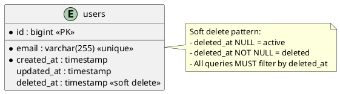
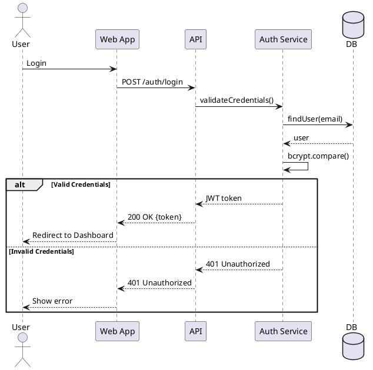
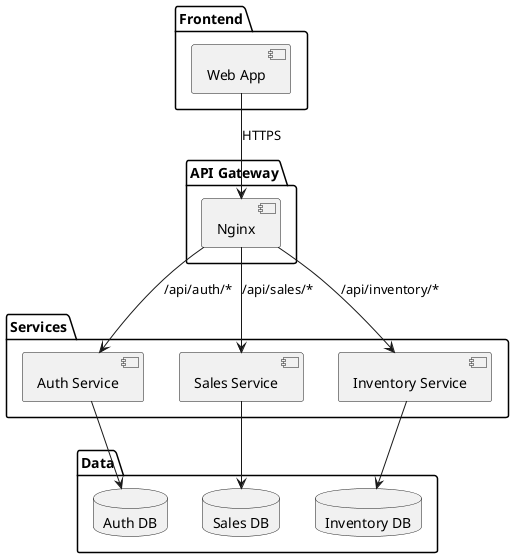

---
# YAML Frontmatter - Metadata for Copilot Auto-Discovery
skill_name: "diagram-creation"
description: "Generate PlantUML diagrams for database schemas, API flows, and architecture. Use when creating ER diagrams, sequence diagrams, or when the user asks for visual documentation."
version: "1.0.0"
last_updated: "2026-01-27"
author: "@Scribe"

# Skill Execution Context
scope: "documentation"
auto_invoke:
  when:
    - "User requests a diagram (ER, sequence, architecture)"
    - "Database schema documentation needs visual representation"
    - "API flow documentation requires sequence diagram"
    - "Architecture documentation needs component diagram"
  conditions:
    - file_patterns:
        ["docs/**/*SCHEMA*.md", "docs/**/*API*.md", "docs/**/*ARCHITECTURE*.md"]
    - keywords:
        [
          "diagram",
          "visual",
          "erd",
          "sequence",
          "plantUML",
          "architecture diagram",
        ]

# Related Skills & Agents
chains_with: ["documentation", "schema-doc-sync", "api-doc-generation"]
invoked_by: ["@Scribe", "@DataArchitect", "@Architect"]
agents: ["@Scribe", "@DataArchitect", "@Architect"]

# Key Topics & Patterns
keywords:
  - "plantUML"
  - "ER diagram"
  - "sequence diagram"
  - "architecture diagram"
  - "database visualization"
  - "API flow visualization"
  - "component diagram"
---

# Skill: diagram-creation

**Purpose:** Generate PlantUML diagrams for database schemas, API flows, and system architecture.

## When to Invoke

| Trigger                        | Use Case                               |
| :----------------------------- | :------------------------------------- |
| Database schema documentation  | Generate ER diagram                    |
| API endpoint documentation     | Generate sequence diagram for flow     |
| Architecture documentation     | Generate component/deployment diagrams |
| User requests "create diagram" | Interactive diagram generation         |
| System integration docs        | Generate interaction diagrams          |

## PlantUML Standards (MANDATORY)

**Ref:** [STANDARDS.md](../../../docs/process/standards/STANDARDS.md)

### Universal Rules

1. **Theme:** ALWAYS use `!theme plain`
2. **Format:** All diagrams MUST be in fenced code blocks with `plantuml` language tag
3. **Placement:** Diagrams go in their own section AFTER text description
4. **Legend:** Include legend for complex diagrams

`````markdown
## Database Schema

<!-- Text description -->

The `users` table stores user authentication data...

````plantuml
!theme plain
@startuml
entity users {
  * id : bigint <<PK>>
  --
  * email : varchar(255) <<unique>>
  * password_hash : varchar(255)
  created_at : timestamp
}
@enduml
\```
````
`````

````

## Diagram Types

### 1. Entity-Relationship (ER) Diagrams

**Use For:** Database schemas, table relationships, data models

**Template:**



**ER Diagram Rules:**

| Element           | Notation                            | Example                  |
| :---------------- | :---------------------------------- | :----------------------- | ----- | ---------- | --- | -------------- | --- | --- | --- | ---------- |
| Primary Key       | `* id : bigint <<PK>>`              | `* id : bigint <<PK>>`   |
| Foreign Key       | `* table_id : bigint <<FK>>`        | `* merchant_id : bigint` |
| Unique Constraint | `* email : varchar(255) <<unique>>` | `* email : varchar(255)` |
| Not Null          | `* column : type`                   | `* name : varchar(255)`  |
| Nullable          | `column : type` (no asterisk)       | `deleted_at : timestamp` |
| Index             | Add `<<index>>` tag                 | `sku : varchar(100)`     |
| Enum              | `status : enum` + legend            | `status : enum`          |
| One-to-One        | `                                   |                          | --    |            | `   | `users         |     | --  |     | merchants` |
| One-to-Many       | `                                   |                          | --o{` | `merchants |     | --o{ products` |
| Many-to-Many      | `}o--o{` (with junction table)      | `products }o--o{ tags`   |

**Complete Example with Relationships:**



### 2. Sequence Diagrams

**Use For:** API flows, authentication flows, synchronization processes

**Template:**



**Sequence Diagram Rules:**

| Element             | Notation                       | Example                           |
| :------------------ | :----------------------------- | :-------------------------------- |
| Actor               | `actor Name`                   | `actor User`                      |
| Participant         | `participant "Label" as Alias` | `participant "API" as API`        |
| Database            | `database "Label" as Alias`    | `database "PostgreSQL" as DB`     |
| Synchronous Call    | `->`                           | `Web -> API : request`            |
| Async Call          | `->>`                          | `API ->> Queue : publish event`   |
| Return              | `-->`                          | `API --> Web : response`          |
| Activate/Deactivate | `activate`/`deactivate`        | `activate API`                    |
| Note                | `note left/right/over : text`  | `note over API : Validates input` |
| Alt/Else            | `alt` / `else` / `end`         | `alt success`                     |
| Loop                | `loop` / `end`                 | `loop for each item`              |

**Complete Example with Error Handling:**



### 3. Architecture Diagrams

**Use For:** System components, deployment diagrams, microservices

**Component Diagram Template:**



**Deployment Diagram Template:**



## Anti-Patterns (FORBIDDEN)

```plantuml
<!-- ❌ NEVER: Missing theme -->
@startuml
entity users {
  id : bigint
}
@enduml

<!-- ❌ NEVER: No primary key indicator -->
entity users {
  id : bigint
  email : varchar(255)
}

<!-- ❌ NEVER: Unclear relationships -->
users -- products

<!-- ❌ NEVER: Missing cardinality -->
users --> products : has

<!-- ✅ CORRECT: Complete ER diagram -->
!theme plain
@startuml
entity users {
  * id : bigint <<PK>>
  --
  * email : varchar(255) <<unique>>
}
entity products {
  * id : bigint <<PK>>
  --
  * user_id : bigint <<FK>>
}
users ||--o{ products : "owns"
@enduml
```



## Diagram Decision Tree

```
User requests diagram?
├─ Database/Schema?
│  └─ Use ER Diagram (entity-relationship)
│     - Show tables, columns, keys
│     - Show relationships with cardinality
│     - Include constraints (PK, FK, unique, index)
│
├─ API/Flow/Process?
│  └─ Use Sequence Diagram
│     - Show request/response flow
│     - Include auth steps
│     - Show error handling (alt/else)
│     - Activate/deactivate participants
│
├─ System/Components?
│  └─ Use Component Diagram
│     - Show modules/services
│     - Show dependencies
│     - Group by layers
│
└─ Deployment/Infrastructure?
   └─ Use Deployment Diagram
      - Show servers/nodes
      - Show load balancers
      - Show replication
```

## Integration with Other Skills

| Skill                | When to Chain                                      |
| :------------------- | :------------------------------------------------- |
| `schema-doc-sync`    | After generating ER diagram for database schema    |
| `api-doc-generation` | After generating sequence diagram for API flow     |
| `documentation`      | When creating complete documentation with diagrams |

## Workflow

1. **Identify diagram type:** ER, Sequence, Component, or Deployment
2. **Gather context:**
   - For ER: Read `schema.prisma` or database schema docs
   - For Sequence: Read API endpoints, controllers, services
   - For Architecture: Read system design docs
3. **Generate PlantUML code** following standards
4. **Include in documentation** with proper markdown fencing
5. **Add text description** before diagram
6. **Test rendering** (optional): Preview with PlantUML viewer

## Common Patterns

### Pattern 1: Database Schema with Soft Deletes



### Pattern 2: Authentication Flow



### Pattern 3: Microservices Architecture



## Error Prevention

| Error                              | Prevention                               |
| :--------------------------------- | :--------------------------------------- | --- | -------- | --- | --- | --- | --- |
| Diagram doesn't render             | ALWAYS start with `!theme plain`         |
| Unclear relationships              | Use cardinality symbols: `               |     | --o{`, ` |     | --  |     | `   |
| Missing foreign keys               | Mark with `<<FK>>` tag                   |
| Unreadable diagrams                | Group entities, use notes, add legends   |
| Sequence diagram activation issues | Match every `activate` with `deactivate` |
| Too complex                        | Split into multiple diagrams by concern  |

## Appendix A: PlantUML Quick Reference

### ER Diagram Symbols

| Symbol | Meaning      | Example Usage                   |
| :----- | :----------- | :------------------------------ | ------- | ----------------------- | --- | --- | --- | ------------------- |
| `      |              | `                               | One (1) | `users                  |     | --  |     | merchants` (1-to-1) |
| `}o`   | Zero or Many | `products }o--o{ tags` (M-to-M) |
| `o{`   | Many         | `merchants                      |         | --o{ products` (1-to-M) |
| `--`   | Relation     | Connects entities               |

### Sequence Diagram Symbols

| Symbol | Meaning    | Example Usage            |
| :----- | :--------- | :----------------------- | --------------- | ----------------------- |
| `->`   | Sync call  | `Web -> API : request`   |
| `-->>` | Async call | `API ->> Queue : event`  |
| `-->`  | Return     | `API --> Web : response` |
| `      |            | `                        | Synchronization | Used for parallel flows |

---

**Version:** 1.0.0
**Last Updated:** 2026-01-27
**Author:** @Scribe
**Related Skills:** documentation, schema-doc-sync, api-doc-generation
````
