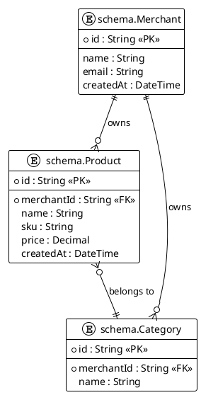

# Schema Documentation Sync Skill

> **Purpose:** Automatically update database schema documentation when Prisma schema changes. Maintains consistency between code and docs.

## Trigger

**When:** After `migration.skill` completes OR `prisma/schema.prisma` is modified
**Context Needed:** Schema diff, affected tables, existing docs
**MCP Tools:** `mcp_payment-syste_query_docs_by_type`, `read_file`, `replace_string_in_file`

## Schema → Doc Mapping

| Schema Model             | Doc File                   | Module         |
| :----------------------- | :------------------------- | :------------- |
| User, Business, Role     | 01-AUTH-SCHEMA.md          | authentication |
| Merchant, Location       | 02-BUSINESS-SCHEMA.md      | business       |
| Notification, Template   | 03-COMMUNICATION-SCHEMA.md | communication  |
| Product, Category, Stock | 04-INVENTORY-SCHEMA.md     | inventory      |
| Order, OrderItem, Cart   | 05-SALES-SCHEMA.md         | sales          |
| Payment, Transaction     | 06-PAYMENTS-SCHEMA.md      | payments       |
| Invoice, TaxConfig       | 07-BILLING-SCHEMA.md       | billing        |
| Customer, Loyalty        | 08-CRM-SCHEMA.md           | crm            |
| Metrics, Reports         | 09-ANALYTICS-SCHEMA.md     | analytics      |

## Update Process

1. **Detect changes** - Parse schema diff
2. **Identify affected docs** - Map models to schema docs
3. **Load existing docs** - Read current content
4. **Update tables** - Modify table definitions
5. **Update stats** - Recalculate schema_stats
6. **Bump version** - Increment patch version
7. **Update date** - Set last_updated to today
8. **Update ER diagram** - Modify FULL-ER-DIAGRAM.md

## Table Format

````markdown
### schema_name.TableName

**Purpose:** [Brief description]

| Column     | Type     | Constraints             | Description        |
| :--------- | :------- | :---------------------- | :----------------- |
| id         | String   | PK, CUID                | Unique identifier  |
| createdAt  | DateTime | NOT NULL, DEFAULT now() | Creation timestamp |
| name       | String   | NOT NULL                | Display name       |
| merchantId | String   | FK → Merchant           | Owner reference    |

**Indexes:**

```sql
CREATE INDEX idx_table_merchant ON schema.Table(merchantId);
CREATE UNIQUE INDEX idx_table_sku ON schema.Table(merchantId, sku);
```
````

**Foreign Keys:**

```sql
ALTER TABLE schema.Table
  ADD CONSTRAINT fk_merchant
  FOREIGN KEY (merchantId)
  REFERENCES schema.Merchant(id)
  ON DELETE CASCADE;
```

**Example Records:**

```sql
INSERT INTO schema.Table (id, merchantId, name, createdAt)
VALUES
  ('cuid1', 'merchant1', 'Example Name', NOW()),
  ('cuid2', 'merchant1', 'Another Name', NOW());
```

````

## Separation of Concerns

### ✅ WHAT TO INCLUDE (Database Schema Docs)

Schema docs MUST contain:

1. **Table Definitions**
   - Full table name: `schema_name.TableName`
   - All columns with types, nullability, defaults
   - Primary keys
2. **Column Details**
   - Data type (String, Int, DateTime, Decimal, etc.)
   - Constraints (NOT NULL, UNIQUE, DEFAULT)
   - Foreign key references
3. **Indexes**
   - Index name
   - Columns in index
   - Index type (B-tree, unique, etc.)
   - SQL CREATE INDEX statement
4. **Foreign Keys**
   - Constraint name
   - Source column → Target table/column
   - ON DELETE/UPDATE behavior
   - SQL ALTER TABLE statement
5. **Triggers** (if applicable)
   - Trigger name
   - Event (BEFORE/AFTER INSERT/UPDATE/DELETE)
   - SQL CREATE TRIGGER statement
6. **Check Constraints**
   - Constraint name
   - Validation rule
   - SQL example
7. **RLS Policies** (if applicable)
   - Policy name
   - Role restrictions
   - SQL CREATE POLICY statement
8. **Example Records**
   - Sample SQL INSERT statements
   - Representative data for each entity
9. **Performance & Indexing Strategy**
   - Index coverage table
   - Common query patterns with SQL
   - Query optimization notes
10. **Migration Strategy**
    - Safe migration steps
    - Dangerous operations warnings
    - Rollback procedures

### ❌ WHAT NOT TO INCLUDE (FORBIDDEN)

Schema docs MUST NOT contain:

1. **UI/UX Flows** → Move to `docs/technical/frontend/ux-flows/`
   - Screen mockups
   - User interaction flows
   - Validation screens
   - Navigation diagrams
   - Button clicks, form submissions
2. **Business Logic Algorithms** → Move to `docs/technical/backend/features/`
   - Calculation formulas
   - Decision trees
   - State machines
   - Rule engines
   - Processing workflows
3. **API Endpoint Definitions** → Move to `docs/technical/backend/api/`
   - HTTP methods (GET, POST, PUT, DELETE)
   - Request/Response DTOs
   - Status codes
   - Authentication headers
   - Rate limiting
4. **Sync Strategies** → Move to ADR or `docs/technical/architecture/sync/`
   - Conflict resolution algorithms
   - Offline behavior
   - Sync protocols
   - Queue management
5. **User Stories** → Move to `docs/technical/backend/features/`
   - "As a user, I want..."
   - Acceptance criteria
   - User personas
6. **Implementation Details** → Move to feature docs
   - Service layer code
   - Controller patterns
   - DTO classes
   - Validation logic

### Common Violation Patterns (Examples)

#### Violation Example 1: UI Flow in DB Doc

**❌ WRONG:**

```markdown
## 5. Product Identification & Validation Flows

### 5.1. Barcode Scanning - The 3 Scenarios

When a user scans a barcode, the system must handle 3 possible outcomes:

1. **Product Found in Catalog**
   - Display product details screen
   - Show "Add to Inventory" button
   - User confirms quantity
````

**✅ CORRECT:**

Move to `docs/technical/frontend/ux-flows/BARCODE-SCANNING.md`

In schema doc, add cross-reference:

```markdown
**Related UX Flows:**

- [Barcode Scanning Flow](../../frontend/ux-flows/BARCODE-SCANNING.md)
```

---

#### Violation Example 2: Business Logic in DB Doc

**❌ WRONG:**

```markdown
## 6. Loyalty Points Calculation Algorithm

Points are calculated as follows:

1. Base points = Purchase amount × 0.01
2. If VIP tier: multiply by 1.5
3. If birthday month: add 100 bonus points
4. Round to nearest integer
```

**✅ CORRECT:**

Move to `docs/technical/backend/features/LOYALTY-CALCULATION.md`

In schema doc, add cross-reference:

```markdown
**Related Business Logic:**

- [Loyalty Points Calculation](../features/LOYALTY-CALCULATION.md)
```

---

#### Violation Example 3: API Endpoints in DB Doc

**❌ WRONG:**

````markdown
## 7. API Integration

### POST /api/v1/products

**Request:**

```json
{
  "name": "Product Name",
  "sku": "PROD-001",
  "price": 9.99
}
```
````

**Response:** 201 Created

````

**✅ CORRECT:**

Move to `docs/technical/backend/api/API-INVENTORY.md`

In schema doc, add cross-reference:

```markdown
**Related API Endpoints:**

- [Inventory API](../../api/API-INVENTORY.md#post-products)
````

## How to Refactor Violations

### Step 1: Identify Violating Sections

Read through schema doc and flag sections that don't belong:

- Look for words like "user", "screen", "button", "flow"
- Look for algorithm descriptions, decision trees
- Look for HTTP methods, request/response formats

### Step 2: Copy Violating Content

Save the violating sections to clipboard.

### Step 3: Create New Document from Correct Template

```bash
# For UI flows
cp docs/templates/06-UX-FLOW-TEMPLATE.md \
   docs/technical/frontend/ux-flows/NEW-FLOW.md

# For business logic
cp docs/templates/01-FEATURE-DESIGN-TEMPLATE.md \
   docs/technical/backend/features/NEW-FEATURE.md

# For API contracts
cp docs/templates/04-API-DESIGN-TEMPLATE.md \
   docs/technical/backend/api/API-NEW.md
```

### Step 4: Fill New Document

- Complete YAML frontmatter
- Paste violating content
- Adapt to template structure
- Add Change Log entry (v1.0.0 - "Extracted from [original]")

### Step 5: Replace in Original Doc

In schema doc, replace violating section with cross-reference:

```markdown
**Related UX Flow:**

- [Barcode Scanning Flow](../../frontend/ux-flows/BARCODE-SCANNING.md)
```

### Step 6: Update Change Logs

**Original schema doc:**

```markdown
| 2026-01-27 | 1.1.0 | @DataArchitect | Refactor: Moved UX flows to separate document |
```

**New UX doc:**

```markdown
| 2026-01-27 | 1.0.0 | @DataArchitect | Extracted from 04-INVENTORY-SCHEMA.md |
```

### Step 7: Commit

```bash
git commit -m "docs(inventory): refactor UX flows to separate document

Moved barcode scanning flow from 04-INVENTORY-SCHEMA.md to
docs/technical/frontend/ux-flows/BARCODE-SCANNING.md
for proper separation of concerns.

- INVENTORY-SCHEMA.md now contains only DB structure
- BARCODE-SCANNING.md created from UX-FLOW template"
```

## Cross-Reference Format

**In schema docs, link to:**

```markdown
**Related Documentation:**

- **Feature Design:** [Inventory Management](../features/INVENTORY-MANAGEMENT.md)
- **API Contracts:** [Inventory API](../api/API-INVENTORY.md)
- **UX Flows:** [Barcode Scanning](../../frontend/ux-flows/BARCODE-SCANNING.md)
- **Sync Strategy:** [Offline Inventory](../../architecture/sync/OFFLINE-INVENTORY.md)
```

## PlantUML ER Diagram Standards

Use PlantUML for Entity-Relationship diagrams:



**Standards:**

- Use `!theme plain`
- Full table names: `schema.TableName`
- Mark PK with `<<PK>>`
- Mark FK with `<<FK>>`
- Use `||--o{` for one-to-many
- Use `}o--||` for many-to-one
- Use `}o--o{` for many-to-many

## Frontmatter Updates

```yaml
# Auto-update these fields
last_updated: "2026-01-27" # Today's date
version: "1.0.1" # Bump patch

# Recalculate these
schema_stats:
  table_count: 5 # Count models in schema
  entity_count: 5 # Same as table_count
  relationship_count: 8 # Count relations
```

## ER Diagram Update

When models change, update PlantUML in FULL-ER-DIAGRAM.md:

```plantuml
' Add new entity
entity "schema.NewModel" as newmodel {
  *id : String <<PK>>
  --
  createdAt : DateTime
  name : String
}

' Add relation
newmodel ||--o{ OtherModel : has
```

## Validation

After sync:

- [ ] Doc version incremented
- [ ] last_updated is today
- [ ] Table columns match schema
- [ ] Indexes documented with SQL
- [ ] Foreign keys documented with SQL
- [ ] Relations accurate
- [ ] NO UI/UX flows in doc
- [ ] NO business logic in doc
- [ ] NO API endpoints in doc
- [ ] Cross-references to other docs present

## Reference

- [03-DATABASE-SCHEMA-TEMPLATE.md](/docs/templates/03-DATABASE-SCHEMA-TEMPLATE.md)
- [FULL-ER-DIAGRAM.md](/docs/technical/backend/database/FULL-ER-DIAGRAM.md)
- [DATABASE-DESIGN.md](/docs/technical/backend/DATABASE-DESIGN.md)
- [DOCUMENTATION-WORKFLOW.md](/docs/process/standards/DOCUMENTATION-WORKFLOW.md) - Section 3 (Separation of Concerns)
