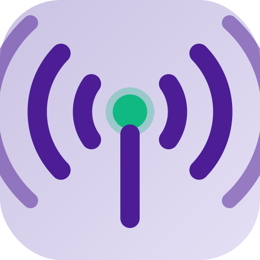

---
# YAML Frontmatter - Metadata for Semantic Search & RAG
document_type: "general"
module: "brand"
status: "approved"
version: "1.0.0"
last_updated: "2026-01-27"
author: "@Scribe"

# Keywords for semantic search
keywords:
  - "logo"
  - "icon"
  - "branding"
  - "visual-assets"
  - "design-guidelines"
  - "favicon"
  - "app-icon"
  - "usage-rules"

# Related documentation
related_docs:
  brand_identity: "docs/business/brand/BRAND-IDENTITY.md"
  visual_identity: "docs/process/standards/VISUAL-IDENTITY.md"
  brand_changelog: "docs/business/brand/BRAND-ASSETS-CHANGELOG.md"
  ui_design: "docs/technical/frontend/UI-DESIGN-SYSTEM.md"

# Document-specific metadata
doc_metadata:
  audience: "designers, developers, marketing"
  complexity: "low"
  estimated_read_time: "12 min"
---

<!-- AI-INSTRUCTION: START -->
<!--
  This document defines LOGO USAGE GUIDELINES.
  1. CRITICAL: All logo usage MUST follow these rules.
  2. This is the authoritative source for logo implementation.
  3. Preserve examples and measurements for design consistency.
-->
<!-- AI-INSTRUCTION: END -->

<table width="100%" border="0" cellspacing="0" cellpadding="0">
  <tr>
    <td width="120" align="center" valign="middle">
      
    </td>
    <td align="left" valign="middle">
      <h1 style="margin: 0; border-bottom: none;">Impulsa Logo Usage Guide</h1>
      <p style="margin: 0; color: #6e7681; font-size: 1.1em;">Rules and specifications for correct usage of the logo and icons</p>
    </td>
  </tr>
</table>

<div align="center">

  
  
  

</div>

---

## Agent Directives (System Prompt)

_This section contains mandatory instructions for AI Agents (Copilot, Cursor, etc.) interacting with this document._

| Directive      | Instruction                                                                             |
| :------------- | :-------------------------------------------------------------------------------------- |
| **Context**    | This document defines the usage rules for the Impulsa logo.                             |
| **Constraint** | NEVER modify the logo without updating this document and the changelog.                 |
| **Pattern**    | Always use the appropriate variant based on context (light/dark/mono).                  |
| **Related**    | `BRAND-IDENTITY.md`, `BRAND-ASSETS-CHANGELOG.md`, `apps/web/src/app/shared/components/` |

---

## 1. Executive Summary

The Impulsa logo represents **growth without limits** through expanding waves emanating from a central point. This document establishes mandatory rules for its correct usage across all platforms and contexts.

**Key concepts:**

- **Symbol:** Expanding concentric waves (NFC/contactless payment style)
- **Meaning:** Connectivity, growth impulse, value transmission
- **Philosophy:** Radical Clarity - simple, clear, functional at all sizes

---

## 2. Logo Anatomy

### 2.1. Symbol Elements

The Impulsa logo consists of the following elements:

```
┌─────────────────────────────────────┐
│     ))) OUTER WAVES (((             │
│                                     │
│    )) MIDDLE WAVES ((               │
│                                     │
│   ) INNER WAVES (                   │
│                                     │
│         ● CENTRAL POINT             │
│         │ (Green pulse)             │
│         │                           │
│         │ ANTENNA/ROOT              │
│         │ (Vertical line)           │
│         │                           │
└─────────────────────────────────────┘
```

**Components:**

1. **Central Point (Pulse):** Represents the merchant, the origin of the impulse
   - Color: Growth Green (#10B981)
   - Effect: Subtle glow for energy feel

2. **Radiating Waves:** 3 levels of concentric arcs
   - Partial arcs (not complete circles)
   - Indicate continuous expansion and dynamic movement
   - Color: Deep Violet (#4C1D95) in light theme, Soft Lavender (#CBC3E3) in dark theme

3. **Antenna/Root:** Vertical line from center downwards
   - Represents: Stability, connection, solid foundation
   - Connects the pulse with the ground/community

4. **Container (icons only):** Squircle (rounded rectangle)
   - Corner radius: 120px on 512x512 canvas (23.4%)
   - Modern app icon standard

### 2.2. Proportions and Spacing

**Protection Area:**

- Minimum clear space around the logo: equivalent to the height of the outer wave
- Do not place text, images, or other elements within this area

**Minimum Size:**

- Digital: 16x16px (favicon)
- Print: 10mm width

---

## 3. Logo Variants

### 3.1. File Inventory

The logo system includes the following variants:

| File                   | Source Location                            | Deployed Location       | Use                                    |
| :--------------------- | :----------------------------------------- | :---------------------- | :------------------------------------- |
| `logo-light.svg`       | `/libs/assets/src/images/`                 | `/assets/images/`       | Full logo with text - Light theme      |
| `logo-dark.svg`        | `/libs/assets/src/images/`                 | `/assets/images/`       | Full logo with text - Dark theme       |
| `icon-light.svg`       | `/libs/assets/src/images/`                 | `/assets/images/`       | Icon only (no text) - Light theme      |
| `icon-dark.svg`        | `/libs/assets/src/images/`                 | `/assets/images/`       | Icon only (no text) - Dark theme       |
| `icon-mono.svg`        | `/libs/assets/src/images/`                 | `/assets/images/`       | Monochrome icon (black on transparent) |
| `favicon.svg`          | `/apps/web/public/`                        | `/favicon.svg` (root)   | Browser tab favicon (16x16/32x32)      |
| `apple-touch-icon.svg` | `/apps/web/public_override/assets/images/` | `/assets/images/`       | Apple Touch Icon 180x180px             |
| `manifest.json`        | `/apps/web/public/`                        | `/manifest.json` (root) | PWA manifest for app installation      |

**Note:** Files in `public/` are copied to the root of the build. Files in `public_override/` override `libs/assets/` in the build output.

### 3.2. Light Theme

**Use:** White or light backgrounds, interfaces in light mode

**Specifications:**

- Background: Soft Lavender (#CBC3E3) with subtle gradient
- Waves: Deep Violet (#4C1D95)
- Pulse: Growth Green (#10B981)
- Text (full logo): Deep Violet (#4C1D95)

**Appropriate contexts:**

- Web app in light mode
- Documentation
- Presentations with light backgrounds
- Marketing on white backgrounds

### 3.3. Dark Theme

**Use:** Dark backgrounds, interfaces in dark mode

**Specifications:**

- Background: Deep Violet (#4C1D95) with subtle gradient
- Waves: Soft Lavender (#CBC3E3)
- Pulse: Growth Green (#10B981) with more intense glow
- Text (full logo): White (#FFFFFF)

**Appropriate contexts:**

- Web app in dark mode
- Splash screens
- Presentations with dark backgrounds
- Marketing on violet/dark backgrounds

### 3.4. Monochrome

**Use:** Contexts without color, black and white printing

**Specifications:**

- No background (transparent)
- All in black (#000000)
- Outer waves with reduced opacity (0.4) for depth
- No color pulse

**Appropriate contexts:**

- Printed technical documentation
- Contracts and legal documents
- Photocopies
- Engravings or prints

---

## 4. Usage Rules

### 4.1. DO USE

**Correct cases:**

1. **In web app:** Use LogoComponent with appropriate variant

   ```typescript
   <app-logo variant="light" type="icon" class="h-10 w-10" />
   ```

2. **In documentation:** Use monochrome or light variant depending on context

3. **In marketing:** Use full logo (with text) whenever space allows

4. **In favicons:** Use optimized versions for each size

5. **With brand backgrounds:** Use on Soft Lavender (#CBC3E3) or Deep Violet (#4C1D95)

### 4.2. DO NOT USE

**PROHIBITED cases:**

1. **DO NOT** modify logo proportions (stretch or compress)
2. **DO NOT** change logo colors
3. **DO NOT** rotate the logo (always vertical, waves upward)
4. **DO NOT** add effects (shadows, embossing, gloss) not specified
5. **DO NOT** place logo on backgrounds without sufficient contrast
6. **DO NOT** use logo in sizes smaller than specified minimum
7. **DO NOT** modify or recreate the logo
8. **DO NOT** use unofficial variants

### 4.3. Contrast and Accessibility

**Golden rule:** Logo MUST comply with WCAG AA (minimum contrast ratio 4.5:1)

| Background              | Variant to Use                        |
| :---------------------- | :------------------------------------ |
| White or very light     | Light                                 |
| Black or very dark      | Dark                                  |
| Soft Lavender (#CBC3E3) | Icon with violet waves (light no bg)  |
| Deep Violet (#4C1D95)   | Icon with lavender waves (dark no bg) |
| Growth Green (#10B981)  | Mono (black)                          |
| Other colors            | Test contrast, use mono if necessary  |

**Verification tools:**

- WebAIM Contrast Checker
- Chrome DevTools Lighthouse

---

## 5. Technical Implementation

### 5.1. In Frontend (Angular)

The logo is implemented via the standalone `LogoComponent`:

**Location:** `/apps/web/src/app/shared/components/atoms/logo/logo.component.ts`

**Usage:**

```typescript
import { LogoComponent } from '@shared/components/atoms/logo/logo.component';

@Component({
  selector: 'my-component',
  imports: [LogoComponent],  // Add to component imports
  template: `
    <app-logo
      [variantInput]="'light'"    // 'light' | 'dark' | 'mono'
      [typeInput]="'icon'"        // 'full' | 'icon'
      [classInput]="'h-12 w-12'"  // Tailwind classes for sizing
    />
  `,
})
```

**Props:**

- `variantInput`: Selects logo theme ('light', 'dark', or 'mono')
- `typeInput`: 'full' includes "Impulsa" text, 'icon' symbol only
- `classInput`: Tailwind CSS classes for size and style

**File Resolution:**

The component automatically resolves to the correct SVG file:

```typescript
// Computed path logic:
const prefix = type === "full" ? "logo" : "icon";
return `/assets/images/${prefix}-${variant}.svg`;

// Examples:
// type='icon', variant='light' → /assets/images/icon-light.svg
// type='full', variant='dark'  → /assets/images/logo-dark.svg
```

### 5.2. In Documentation

To include the logo in Markdown files:

```markdown
<!-- Logo in document header -->


<!-- Inline logo in text -->


```

### 5.3. In PWA and Manifests

**File:** `/apps/web/public/manifest.json`

```json
{
  "name": "Impulsa",
  "short_name": "Impulsa",
  "description": "Business management platform for LATAM merchants",
  "start_url": "/",
  "display": "standalone",
  "background_color": "#ffffff",
  "theme_color": "#4C1D95",
  "icons": [
    {
      "src": "/assets/images/icon-light.svg",
      "sizes": "any",
      "type": "image/svg+xml",
      "purpose": "any maskable"
    },
    {
      "src": "/assets/images/apple-touch-icon.svg",
      "sizes": "180x180",
      "type": "image/svg+xml"
    }
  ]
}
```

**File:** `/apps/web/src/index.html`

```html
<!-- Favicons -->
<link rel="icon" href="/favicon.svg" type="image/svg+xml" />
<link
  rel="icon"
  href="/assets/images/icon-light.svg"
  type="image/svg+xml"
  sizes="any"
/>
<link
  rel="apple-touch-icon"
  sizes="180x180"
  href="/assets/images/apple-touch-icon.svg"
/>
<link rel="manifest" href="/manifest.json" />
```

**Important Notes:**

1. **Favicon Caching:** Browsers aggressively cache favicons. To see changes:
   - Clear browser cache: `Ctrl + Shift + Delete`
   - Hard refresh: `Ctrl + F5`
   - Test in incognito mode

2. **Angular Assets Configuration:** Both `public` and `public_override` folders must be listed in `angular.json`:

```json
"assets": [
  {
    "glob": "**/*",
    "input": "public"
  },
  {
    "glob": "**/*",
    "input": "public_override"
  }
]
```

1. **File Override Priority:** `public_override/` files take precedence over `libs/assets/` files during build.

---

## 6. Common Use Cases

### 6.1. App Splash Screen

- **Variant:** icon-light.svg or icon-dark.svg based on device theme
- **Size:** 512x512px centered
- **Background:** Brand gradient (lavender to violet)
- **Allowed animation:** Fade in of central pulse, wave expansion

### 6.2. Physical QR Stands

- **Variant:** Full logo (logo-light.svg) printed
- **Minimum size:** 30mm width
- **Position:** Top corner of stand
- **Material:** High-quality print, preferably matte

### 6.3. Emails and Signatures

- **Variant:** Full logo (logo-light.svg) as exported PNG
- **Size:** 150px width maximum
- **Position:** Email header or signature footer
- **Format:** PNG with transparent background (exported from SVG)

### 6.4. Social Media

| Platform          | Size      | Variant to Use |
| :---------------- | :-------- | :------------- |
| Facebook          | 180x180px | icon-light.svg |
| Instagram         | 320x320px | icon-light.svg |
| Twitter/X         | 400x400px | icon-light.svg |
| LinkedIn          | 300x300px | icon-light.svg |
| WhatsApp Business | 640x640px | icon-light.svg |

---

## 7. Export and Formats

### 7.1. SVG (Preferred)

- **Use:** Web, apps, scalable without loss
- **Advantages:** Lightweight, editable, responsive
- **Master files:** `/libs/assets/src/images/`

### 7.2. PNG (When necessary)

For cases where SVG is not supported:

**Export from SVG with these specifications:**

| Size        | Use                        | DPI |
| :---------- | :------------------------- | :-- |
| 16x16px     | Legacy favicon             | 72  |
| 32x32px     | Legacy favicon             | 72  |
| 48x48px     | Legacy favicon             | 72  |
| 180x180px   | Apple Touch Icon           | 72  |
| 192x192px   | Android Chrome             | 72  |
| 512x512px   | Android Chrome, PWA        | 72  |
| 1024x1024px | Marketing, high resolution | 300 |

**Recommended tools:**

- Inkscape (CLI): `inkscape --export-type=png --export-dpi=72 --export-width=512 icon-light.svg`
- ImageMagick: `convert -density 72 -resize 512x512 icon-light.svg icon-512.png`

### 7.3. Other Formats (Special Cases)

- **ICO:** Generate from PNG for IE compatibility (legacy)
- **PDF:** Export SVG to vector PDF for professional printing
- **EPS:** Only if print provider requires it

---

## 8. Frequently Asked Questions

**Q: Can I use the logo in my personal presentation?**
A: Yes, if the presentation is about Impulsa or related to the business. Use the appropriate variant based on your background.

**Q: What do I do if I need the logo in an unspecified color?**
A: Use the monochrome variant (icon-mono.svg) and apply color via CSS or design software, only if absolutely necessary. Preferably, use official variants.

**Q: Can I animate the logo?**
A: Yes, but only subtle animations: fade in, wave expansion, center pulse. No rotation, no distortion, no excessive effects.

**Q: The logo doesn't look good at small size (16px), what do I do?**
A: Use favicon.svg which is optimized for small sizes with fewer details.

**Q: Where can I get the logo in other formats?**
A: All master files are in `/libs/assets/src/images/`. If you need another format, export from SVG following section 7 specifications.

---

## 9. Contact and Approvals

For logo usage inquiries or to request exceptions:

- **Design approval:** @Frontend, @Scribe
- **Business approval:** @ProductOwner
- **Technical support:** @Backend (for code implementation)

**Approval process:**

1. Create a GitHub issue with the proposed usage
2. Include mockup or example of proposed use
3. Wait for approval from at least 1 design stakeholder + 1 business stakeholder
4. Document the decision in BRAND-ASSETS-CHANGELOG.md

---

## Appendix A: Change Log

| Date       | Version | Author  | Changes                                                                                                                            |
| :--------- | :------ | :------ | :--------------------------------------------------------------------------------------------------------------------------------- |
| 2026-01-27 | 1.0.0   | @Scribe | Initial guide creation. New logo system with 5 variants (light, dark, mono, full, icon). Complete usage and export specifications. |

---

## Appendix B: Implementation Checklist

Before using the logo in a new context, verify:

- [ ] I have selected the correct variant (light/dark/mono)
- [ ] I have verified contrast (WCAG AA minimum)
- [ ] Size is greater than or equal to specified minimum
- [ ] I have not modified proportions or colors
- [ ] I have respected the protection area
- [ ] I have included appropriate alt text (accessibility)
- [ ] I have used the official component (in frontend) or master file (in docs)
- [ ] If non-standard usage, I have requested approval

---

_This document is the authoritative source for Impulsa logo usage. Any deviation must be approved and documented._
