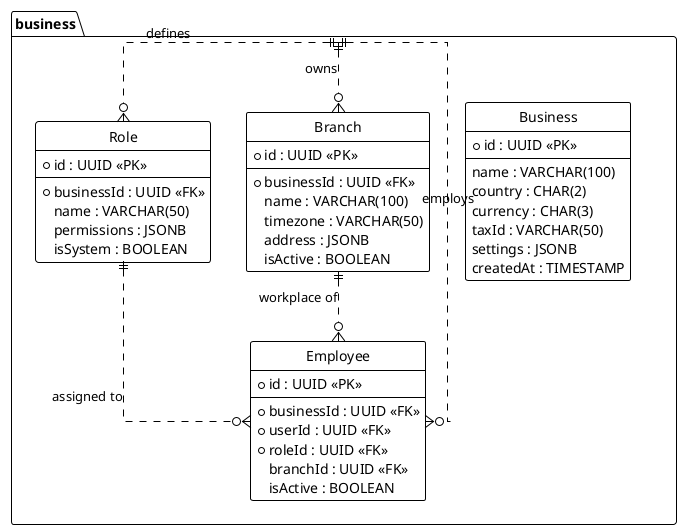

<!-- AI-INSTRUCTION: START -->
<!--
  This document defines the BUSINESS SCHEMA.
  1. Preserve the Header Table and Metadata block.
  2. Fill in the "Agent Directives" to guide future AI interactions.
  3. Keep the structure strict for RAG (Retrieval Augmented Generation) efficiency.
-->
<!-- AI-INSTRUCTION: END -->

<table width="100%" border="0" cellspacing="0" cellpadding="0">
  <tr>
    <td width="120" align="center" valign="middle">
      
    </td>
    <td align="left" valign="middle">
      <h1 style="margin: 0; border-bottom: none;">Business Schema (Core & RBAC)</h1>
      
Organization, Branch, and Employee Management

    </td>
  </tr>
</table>

  <!-- METADATA BADGES -->
  
  
  

---

## 🤖 Agent Directives (System Prompt)

_This section contains mandatory instructions for AI Agents (Copilot, Cursor, etc.) interacting with this document._

| Directive      | Instruction                                                                                       |
| :------------- | :------------------------------------------------------------------------------------------------ |
| **Context**    | Defines the hierarchical structure of businesses, branches, and the people who work in them.      |
| **Constraint** | **Multi-Tenancy:** All queries MUST be scoped by `businessId`.                                    |
| **Pattern**    | **RBAC:** Permissions are assigned to Roles, Roles are assigned to Employees.                     |
| **Rule**       | **Timezones:** The `Branch` entity dictates the timezone for all operations within that location. |
| **Related**    | `apps/backend/src/modules/business/`                                                              |

---

## 1. Executive Summary

The **Business Schema** handles the organizational structure. It supports a hierarchy where a **Business** (Tenant) can have multiple **Branches** (Locations).

Key capabilities:

1.  **Multi-Location:** Centralized management of products/employees across multiple physical stores.
2.  **Granular RBAC:** Role-Based Access Control allows defining custom roles (e.g., "Shift Manager", "Inventory Clerk").
3.  **Localization:** Each branch can have its own Timezone, Language, and Tax settings.

---

## 2. Entity-Relationship Diagram

---

## 3. Detailed Entity Definitions

### 3.1. Business (The Tenant)

The top-level entity representing the company.

| Attribute  | Type    | Description              | Rules & Constraints                           |
| :--------- | :------ | :----------------------- | :-------------------------------------------- |
| `id`       | UUID    | Primary Key.             |                                               |
| `country`  | CHAR(2) | ISO 3166-1 alpha-2 code. | Determines the Payment Adapter and Tax Rules. |
| `settings` | JSONB   | Global config.           | e.g., `{ "allowNegativeStock": false }`.      |

### 3.2. Branch (The Location)

A physical or logical location where sales occur.

| Attribute  | Type    | Description       | Rules & Constraints                |
| :--------- | :------ | :---------------- | :--------------------------------- |
| `timezone` | VARCHAR | IANA Timezone.    | Critical for "End of Day" reports. |
| `address`  | JSONB   | Physical address. | Used for receipts/invoices.        |

### 3.3. Employee (The Staff)

Links a Global `User` to a specific `Business` with a specific `Role`.

| Attribute  | Type | Description           | Rules & Constraints                                  |
| :--------- | :--- | :-------------------- | :--------------------------------------------------- |
| `userId`   | UUID | Link to Auth Schema.  |                                                      |
| `roleId`   | UUID | The permissions set.  |                                                      |
| `branchId` | UUID | Optional home branch. | If null, employee is "HQ" (can access all branches). |

---

## 4. Access Control (RBAC)

Permissions are stored in the `Role` entity as a JSON array of strings.
Example: `["SALES_CREATE", "INVENTORY_READ", "REPORTS_VIEW"]`.
