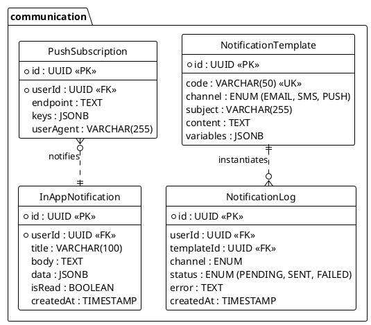

<!-- AI-INSTRUCTION: START -->
<!--
  This document defines the COMMUNICATION SCHEMA.
  1. Preserve the Header Table and Metadata block.
  2. Fill in the "Agent Directives" to guide future AI interactions.
  3. Keep the structure strict for RAG (Retrieval Augmented Generation) efficiency.
-->
<!-- AI-INSTRUCTION: END -->

<table width="100%" border="0" cellspacing="0" cellpadding="0">
  <tr>
    <td width="120" align="center" valign="middle">
      
    </td>
    <td align="left" valign="middle">
      <h1 style="margin: 0; border-bottom: none;">Communication Schema</h1>
      
Notifications, Templates, and Push Messaging

    </td>
  </tr>
</table>

  <!-- METADATA BADGES -->
  
  
  

---

## 🤖 Agent Directives (System Prompt)

_This section contains mandatory instructions for AI Agents (Copilot, Cursor, etc.) interacting with this document._

| Directive      | Instruction                                                                                               |
| :------------- | :-------------------------------------------------------------------------------------------------------- |
| **Context**    | Manages all outbound communication (Email, SMS, Push) and internal alerts.                                |
| **Constraint** | **No Raw HTML:** Content MUST be generated from `NotificationTemplate`.                                   |
| **Pattern**    | **Hot/Cold Storage:** `InAppNotification` is for UI display (Hot). `NotificationLog` is for audit (Cold). |
| **Rule**       | **Async:** Sending is always handled by background workers (BullMQ).                                      |
| **Related**    | `apps/backend/src/modules/notifications/`                                                                 |

---

## 1. Executive Summary

The **Communication Schema** centralizes how the platform talks to users. It abstracts the provider (SendGrid, Twilio, Firebase) from the business logic.

Key capabilities:

1.  **Omnichannel:** Send one event ("Order Confirmed"), deliver via multiple channels (Email + Push).
2.  **Templating:** MJML/Handlebars support for consistent branding.
3.  **Audit:** Track delivery status (Sent, Delivered, Failed, Opened).

---

## 2. Entity-Relationship Diagram

---

## 3. Detailed Entity Definitions

### 3.1. NotificationTemplate

Stores the blueprints for messages.

| Attribute | Type    | Description        | Rules & Constraints                       |
| :-------- | :------ | :----------------- | :---------------------------------------- |
| `code`    | VARCHAR | Unique slug.       | e.g., `WELCOME_EMAIL`, `PAYMENT_RECEIPT`. |
| `content` | TEXT    | The body template. | MJML for Email, Plain text for SMS.       |

### 3.2. InAppNotification (The Bell Icon)

Stores persistent alerts shown in the application UI.

| Attribute | Type    | Description     | Rules & Constraints                |
| :-------- | :------ | :-------------- | :--------------------------------- |
| `isRead`  | BOOLEAN | Read status.    | Used to show "Unread count" badge. |
| `data`    | JSONB   | Action payload. | e.g., `{ "link": "/orders/123" }`. |

### 3.3. NotificationLog

Audit trail for all sent messages.

| Attribute | Type | Description     | Rules & Constraints                                  |
| :-------- | :--- | :-------------- | :--------------------------------------------------- |
| `status`  | ENUM | Delivery state. | Updated via Webhooks (e.g., SendGrid Event Webhook). |
