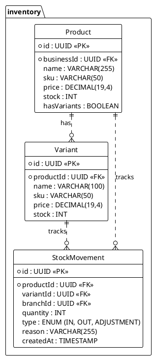

<!-- AI-INSTRUCTION: START -->
<!--
  This document defines the INVENTORY SCHEMA.
  1. Preserve the Header Table and Metadata block.
  2. Fill in the "Agent Directives" to guide future AI interactions.
  3. Keep the structure strict for RAG (Retrieval Augmented Generation) efficiency.
-->
<!-- AI-INSTRUCTION: END -->

<table width="100%" border="0" cellspacing="0" cellpadding="0">
  <tr>
    <td width="120" align="center" valign="middle">
      
    </td>
    <td align="left" valign="middle">
      <h1 style="margin: 0; border-bottom: none;">Inventory Schema</h1>
      
Products, Stock, and Supply Chain

    </td>
  </tr>
</table>

  <!-- METADATA BADGES -->
  
  
  

---

## 🤖 Agent Directives (System Prompt)

_This section contains mandatory instructions for AI Agents (Copilot, Cursor, etc.) interacting with this document._

| Directive      | Instruction                                                                                                |
| :------------- | :--------------------------------------------------------------------------------------------------------- |
| **Context**    | Manages the catalog, stock levels, and movements of goods.                                                 |
| **Constraint** | **Negative Stock:** Configurable per Business. Default is `false`.                                         |
| **Pattern**    | **Event Sourcing:** Stock is calculated by summing `StockMovement`. `Product.stock` is a cache.            |
| **Rule**       | **Variants:** Products can have variants (Size/Color). If variants exist, parent stock is sum of variants. |
| **Related**    | `apps/backend/src/modules/inventory/`                                                                      |

---

## 1. Executive Summary

The **Inventory Schema** is designed for retail and hospitality. It supports complex product structures (variants, bundles) and multi-location stock tracking.

Key capabilities:

1.  **Variants:** T-Shirt (Red/L, Red/M).
2.  **Stock History:** Full audit trail of every item entering or leaving via `StockMovement`.
3.  **Low Stock Alerts:** Automated notifications when threshold is breached.

---

## 2. Entity-Relationship Diagram

---

## 3. Detailed Entity Definitions

### 3.1. Product

The main catalog item.

| Attribute | Type    | Description         | Rules & Constraints             |
| :-------- | :------ | :------------------ | :------------------------------ |
| `sku`     | VARCHAR | Stock Keeping Unit. | Unique per Business.            |
| `price`   | DECIMAL | Base selling price. | 4 decimal places for precision. |

### 3.2. StockMovement

The ledger of inventory changes.

| Attribute  | Type | Description        | Rules & Constraints                                       |
| :--------- | :--- | :----------------- | :-------------------------------------------------------- |
| `type`     | ENUM | Direction of flow. | `IN` (Purchase), `OUT` (Sale), `ADJUSTMENT` (Loss/Found). |
| `quantity` | INT  | Amount changed.    | Can be negative for OUT.                                  |
