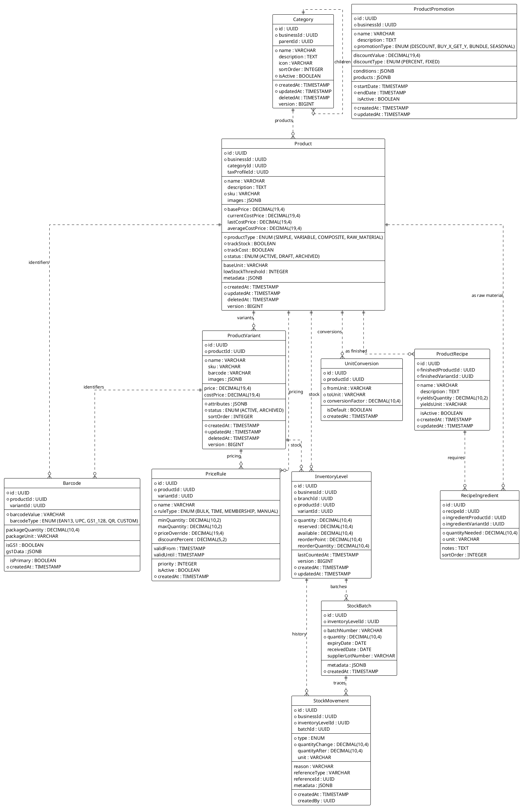

---
# YAML Frontmatter - Metadata for Semantic Search & RAG
document_type: "database-schema"
module: "inventory"
status: "approved"
version: "2.0.0"
last_updated: "2025-11-27"
author: "@Architect"

# Keywords for semantic search and MCP tool discovery
keywords:
  - "inventory"
  - "products"
  - "catalog"
  - "stock"
  - "barcode"
  - "cost-tracking"
  - "recipes"
  - "variants"
  - "pricing"
  - "suppliers"

# Related documentation
related_docs:
  api_design: ""  # To be created: docs/technical/backend/api/INVENTORY-API.md
  ux_flow: ""  # To be created: docs/technical/frontend/ux-flows/INVENTORY-BARCODE-SCANNING.md
  feature_design: "docs/technical/backend/features/INVENTORY-MANAGEMENT.md"
  sync_strategy: ""  # To be created: docs/technical/architecture/INVENTORY-SYNC-STRATEGY.md

# Database metadata
database:
  engine: "PostgreSQL"
  min_version: "16.0"
  prisma_version: "5.0+"

# Schema statistics
schema_stats:
  total_tables: 12
  total_indexes: 24
  total_constraints: 18
  estimated_rows: "10K-100K"  # Per business
---

<!-- AI-INSTRUCTION: START -->
<!--
  This document defines the INVENTORY SCHEMA.
  1. Preserve the Header Table and Metadata block.
  2. Fill in the "Agent Directives" to guide future AI interactions.
  3. Keep the structure strict for RAG (Retrieval Augmented Generation) efficiency.
-->
<!-- AI-INSTRUCTION: END -->

<table width="100%" border="0" cellspacing="0" cellpadding="0">
  <tr>
    <td width="120" align="center" valign="middle">
      
    </td>
    <td align="left" valign="middle">
      <h1 style="margin: 0; border-bottom: none;">Inventory Schema</h1>
      <p style="margin: 0; color: #6e7681; font-size: 1.1em;">Products, Stock, and Supply Chain</p>
    </td>
  </tr>
</table>

<div align="center">

  <!-- METADATA BADGES -->
  
  
  

</div>

---

## 🤖 Agent Directives (System Prompt)

_This section contains mandatory instructions for AI Agents (Copilot, Cursor, etc.) interacting with this document._

| Directive      | Instruction                                                                                        |
| :------------- | :------------------------------------------------------------------------------------------------- |
| **Context**    | Manages the catalog, stock levels, and movements of goods.                                         |
| **Constraint** | **Offline-First:** All entities must support version-based syncing.                                |
| **Pattern**    | **Optimistic UI:** Stock changes are applied locally first, then synced as `StockMovement` deltas. |
| **Rule**       | **Variants:** Use `JSONB` for flexible attributes (e.g., Size, Color) instead of EAV tables.       |
| **Related**    | `apps/backend/src/modules/inventory/`                                                              |

---

## 1. Executive Summary

The **Inventory Schema** manages the core catalog, stock tracking, pricing strategies, and cost analytics. It is designed to handle both **Simple Products** and **Variable Products** with a flexible attribute system, plus advanced features for retail and food service businesses.

Key capabilities:

1.  **Smart Barcode Scanning:** GS1 standard support for automatic package detection (1 box scan = 12 items).
2.  **Flexible Variants:** JSONB-based attributes allow for unlimited variation types without schema migration.
3.  **Multi-Location:** Stock is tracked per branch with real-time sync.
4.  **Dynamic Pricing:** Promotions, discounts, bulk pricing, 2x1 offers, seasonal campaigns.
5.  **Recipe Cost Tracking:** Auto-calculate exact cost and profit margin for composite products.
6.  **Audit Trail:** Immutable `StockMovement` log for every inventory change.
7.  **Business Intelligence Ready:** Pre-calculated metrics for dashboards (cost, margin, turnover).
8.  **Offline Sync:** Optimistic locking for conflict resolution.

---

## 2. Entity-Relationship Diagram



---

## 3. Detailed Entity Definitions

### 3.1. Category

Organizes products into a hierarchical tree structure for better catalog organization and navigation.

| Attribute     | Type         | Description         | Rules & Constraints                                                  |
| :------------ | :----------- | :------------------ | :------------------------------------------------------------------- |
| `id`          | UUID         | Unique identifier.  | Primary Key.                                                         |
| `businessId`  | UUID         | Tenant owner.       | Foreign Key to `business.Business`. All queries MUST filter by this. |
| `parentId`    | UUID         | Parent category.    | Foreign Key to `Category`. NULL for root categories.                 |
| `name`        | VARCHAR(100) | Category name.      | e.g., "Beverages", "Electronics". Displayed in POS navigation.       |
| `description` | TEXT         | Optional details.   | Markdown supported for rich formatting.                              |
| `icon`        | VARCHAR(100) | Icon identifier.    | e.g., `food`, `shirt`, `tool`. Used in UI for visual navigation.     |
| `sortOrder`   | INTEGER      | Display order.      | Lower numbers appear first. Default: 0.                              |
| `isActive`    | BOOLEAN      | Visibility flag.    | If `false`, hidden from POS but still accessible in admin.           |
| `version`     | BIGINT       | Optimistic lock.    | Incremented on every update. Used for offline conflict resolution.   |
| `createdAt`   | TIMESTAMP    | Creation time.      | Auto-generated. UTC timezone.                                        |
| `updatedAt`   | TIMESTAMP    | Last modification.  | Auto-updated on change.                                              |
| `deletedAt`   | TIMESTAMP    | Soft delete marker. | If set, category is archived.                                        |

**Business Rules:**

- **Self-Referential:** `parentId` allows infinite nesting (e.g., Food > Beverages > Soft Drinks).
- **Constraint:** Cannot delete a category with active products. Must reassign or archive products first.
- **Sync:** Full sync to device on login. Incremental updates via `version` field.

### 3.2. Product

The core catalog item representing goods or services sold by the business.

| Attribute           | Type          | Description           | Rules & Constraints                                                          |
| :------------------ | :------------ | :-------------------- | :--------------------------------------------------------------------------- |
| `id`                | UUID          | Unique identifier.    | Primary Key.                                                                 |
| `businessId`        | UUID          | Tenant owner.         | Foreign Key to `business.Business`.                                          |
| `categoryId`        | UUID          | Product category.     | Foreign Key to `Category`.                                                   |
| `taxProfileId`      | UUID          | Tax configuration.    | Foreign Key to `billing.TaxProfile`.                                         |
| `name`              | VARCHAR(200)  | Product name.         | e.g., "Coca-Cola 355ml". Displayed on receipts.                              |
| `description`       | TEXT          | Product details.      | Rich text supported. Used for staff training notes.                          |
| `sku`               | VARCHAR(50)   | Stock Keeping Unit.   | Internal code. Unique per business.                                          |
| `barcode`           | VARCHAR(50)   | Barcode/EAN.          | Can be NULL for non-retail items.                                            |
| `images`            | JSONB         | Product images.       | Array of URLs: `[{"url": "...", "isPrimary": true}]`.                        |
| `price`             | DECIMAL(19,4) | Base selling price.   | **MUST use DECIMAL** for financial precision.                                |
| `costPrice`         | DECIMAL(19,4) | Acquisition cost.     | Used for profit margin calculations. **Sensitive data**.                     |
| `productType`       | ENUM          | Product type.         | `SIMPLE`, `VARIABLE`, `COMPOSITE` (has recipe), `RAW_MATERIAL` (ingredient). |
| `trackStock`        | BOOLEAN       | Inventory tracking.   | If `false`, assumes infinite stock (useful for services).                    |
| `baseUnit`          | VARCHAR(20)   | Base unit of measure. | e.g., `kg`, `L`, `pcs`, `box`. Used for conversions.                         |
| `lowStockThreshold` | INTEGER       | Alert level.          | When stock falls below this, trigger `LOW_STOCK` notification.               |
| `status`            | ENUM          | Product state.        | `ACTIVE` (visible), `DRAFT` (hidden), `ARCHIVED` (discontinued).             |
| `metadata`          | JSONB         | Custom fields.        | Flexible storage for business-specific attributes.                           |
| `version`           | BIGINT        | Optimistic lock.      | Incremented on every update.                                                 |
| `createdAt`         | TIMESTAMP     | Creation time.        | UTC timezone.                                                                |
| `updatedAt`         | TIMESTAMP     | Last modification.    | Auto-updated.                                                                |
| `deletedAt`         | TIMESTAMP     | Soft delete marker.   | Products are never hard-deleted.                                             |

**Business Rules:**

- **Product Type Logic:**
  - `SIMPLE`: Regular product. Stock tracked at product level. No variants.
  - `VARIABLE`: Product with variants (e.g., sizes, colors). Stock tracked per variant.
  - `COMPOSITE`: Finished product made from other products (has recipe). Stock auto-calculated from ingredients.
  - `RAW_MATERIAL`: Ingredient/component not sold directly. Used in recipes. Examples: tomatoes, flour, screws.
- **Pricing:**
  - `basePrice` is the "list price" before discounts.
  - Actual selling price = `basePrice` - active promotions/discounts.
  - `RAW_MATERIAL` products may have `basePrice = 0` (not sold directly).
  - `COMPOSITE` products cost is auto-calculated from recipe ingredients.
- **Cost Tracking (Triple Method):**
  - `currentCostPrice`: Most recent purchase cost. Used for "Last In, First Out" (LIFO).
  - `averageCostPrice`: Weighted average. Used for accurate COGS reporting.
  - `lastCostPrice`: Previous cost. Alerts when supplier raises prices.
- **Base Unit:** Required for `RAW_MATERIAL` and `COMPOSITE` products for recipe calculations.
- **Security:** All cost fields visibility restricted by `COST_VIEW` permission.
- **Uniqueness:** `(businessId, sku)` must be unique.

---

### 3.3. Barcode (Smart Scanning)

Stores multiple barcodes per product with package quantity information for smart inventory receiving.

| Attribute         | Type          | Description         | Rules & Constraints                                                           |
| :---------------- | :------------ | :------------------ | :---------------------------------------------------------------------------- |
| `id`              | UUID          | Unique identifier.  | Primary Key.                                                                  |
| `productId`       | UUID          | Product reference.  | Foreign Key to `Product`.                                                     |
| `variantId`       | UUID          | Variant reference.  | Foreign Key to `ProductVariant`. NULL for simple products.                    |
| `barcodeValue`    | VARCHAR(100)  | The barcode string. | The actual scannable code.                                                    |
| `barcodeType`     | ENUM          | Barcode format.     | `EAN13`, `UPC`, `GS1_128`, `QR`, `CUSTOM`.                                    |
| `packageQuantity` | DECIMAL(10,4) | Units in package.   | How many individual items this barcode represents.                            |
| `packageUnit`     | VARCHAR(20)   | Package unit.       | e.g., `box`, `case`, `pallet`. Links to `UnitConversion`.                     |
| `isGS1`           | BOOLEAN       | GS1 compliant.      | If `true`, barcode contains structured data (GTIN, batch, expiry).            |
| `gs1Data`         | JSONB         | Parsed GS1 data.    | `{"gtin": "...", "batchNumber": "...", "expiryDate": "...", "quantity": 12}`. |
| `isPrimary`       | BOOLEAN       | Default barcode.    | Used when product is added manually (not scanned).                            |
| `createdAt`       | TIMESTAMP     | Creation time.      | UTC.                                                                          |

**Business Rules:**

- **Multiple Barcodes:** A product can have multiple barcodes:
  - Individual unit barcode: `7501234567890` → 1 piece
  - Box barcode: `17501234567897` → 12 pieces
  - Case barcode: `27501234567894` → 144 pieces (12 boxes)
- **Smart Receiving:** When scanning a box barcode, system auto-detects `packageQuantity` and updates stock accordingly.
- **GS1 Standard:** If `isGS1 = true`, system parses:
  - **GTIN** (Global Trade Item Number)
  - **Batch/Lot Number** (AI 10)
  - **Expiry Date** (AI 17)
  - **Quantity** (AI 30)
- **Primary Barcode:** The `isPrimary` barcode is used in POS display and when generating labels.

**Example - Smart Scanning Flow:**

```typescript
// User scans box barcode
const scannedCode = '17501234567897';
const barcodeInfo = await findBarcode(scannedCode);

// Result:
{
  productId: 'abc-123',
  product: 'Sabritas Original 45g',
  packageQuantity: 12,
  packageUnit: 'box',
  isGS1: true,
  gs1Data: {
    gtin: '7501234567890',
    batchNumber: 'LOT-2025-456',
    expiryDate: '2026-06-15'
  }
}

// System automatically:
// 1. Creates StockBatch with expiry date
// 2. Updates InventoryLevel.quantity += 12 pieces
// 3. Creates StockMovement: +12 pcs (RESTOCK)
```

---

### 3.4. PriceRule (Dynamic Pricing)

Defines flexible pricing strategies: bulk discounts, time-based pricing, VIP pricing.

| Attribute         | Type          | Description          | Rules & Constraints                                                                |
| :---------------- | :------------ | :------------------- | :--------------------------------------------------------------------------------- |
| `id`              | UUID          | Unique identifier.   | Primary Key.                                                                       |
| `productId`       | UUID          | Product reference.   | Foreign Key to `Product`.                                                          |
| `variantId`       | UUID          | Variant reference.   | Foreign Key to `ProductVariant`. NULL if applies to all variants.                  |
| `name`            | VARCHAR(200)  | Rule name.           | e.g., "Bulk Discount 10+", "Happy Hour 50%".                                       |
| `ruleType`        | ENUM          | Pricing strategy.    | `BULK` (quantity-based), `TIME` (hour/day), `MEMBERSHIP` (loyalty tier), `MANUAL`. |
| `minQuantity`     | DECIMAL(10,2) | Minimum qty.         | Rule activates when cart quantity >= this. NULL if not quantity-based.             |
| `maxQuantity`     | DECIMAL(10,2) | Maximum qty.         | Rule applies until this quantity. NULL for unlimited.                              |
| `priceOverride`   | DECIMAL(19,4) | Fixed price.         | If set, replaces `basePrice` entirely.                                             |
| `discountPercent` | DECIMAL(5,2)  | Discount percentage. | If set, applies `basePrice * (1 - discount/100)`.                                  |
| `validFrom`       | TIMESTAMP     | Start date/time.     | Rule activates at this time. NULL for always active.                               |
| `validUntil`      | TIMESTAMP     | End date/time.       | Rule expires. NULL for no expiry.                                                  |
| `priority`        | INTEGER       | Evaluation order.    | Lower number = higher priority. When multiple rules match, highest priority wins.  |
| `isActive`        | BOOLEAN       | Enable/disable.      | Quick toggle without deleting rule.                                                |
| `createdAt`       | TIMESTAMP     | Creation time.       | UTC.                                                                               |

**Business Rules:**

- **Mutual Exclusivity:** Either `priceOverride` OR `discountPercent` must be set, not both.
- **Rule Stacking:** By default, only highest priority matching rule applies (no stacking).
- **Time-Based:** `validFrom`/`validUntil` enable temporary promotions (Black Friday, Happy Hour).
- **Bulk Pricing:** Create multiple rules for tiered pricing:

**Example - Tiered Bulk Pricing:**

```sql
-- Coca-Cola base price: $15 MXN

PriceRule 1: Buy 1-5 → $15 each (no rule, base price)
PriceRule 2: Buy 6-11 → $14 each (7% discount)
  minQuantity=6, maxQuantity=11, discountPercent=6.67, priority=10

PriceRule 3: Buy 12+ → $12 each (20% discount)
  minQuantity=12, maxQuantity=NULL, discountPercent=20, priority=5
```

**Example - Happy Hour (Time-Based):**

```sql
PriceRule: "Café 50% Off (7-9am)"
  ruleType=TIME
  validFrom=07:00:00
  validUntil=09:00:00
  discountPercent=50
  priority=1
```

**POS Calculation Logic:**

```typescript
async function calculatePrice(productId: string, quantity: number) {
  const product = await getProduct(productId);
  let finalPrice = product.basePrice;

  // Find matching rules
  const rules = await findActiveRules(productId, quantity);

  if (rules.length > 0) {
    // Apply highest priority rule
    const rule = rules[0]; // Already sorted by priority ASC

    if (rule.priceOverride) {
      finalPrice = rule.priceOverride;
    } else if (rule.discountPercent) {
      finalPrice = product.basePrice * (1 - rule.discountPercent / 100);
    }
  }

  return finalPrice * quantity;
}
```

---

### 3.5. ProductPromotion (Campaign Management)

Manages complex promotions: 2x1, bundles, seasonal campaigns.

| Attribute       | Type          | Description        | Rules & Constraints                                                                              |
| :-------------- | :------------ | :----------------- | :----------------------------------------------------------------------------------------------- |
| `id`            | UUID          | Unique identifier. | Primary Key.                                                                                     |
| `businessId`    | UUID          | Tenant owner.      | Foreign Key to `business.Business`.                                                              |
| `name`          | VARCHAR(200)  | Campaign name.     | e.g., "2x1 en Refrescos", "Black Friday Bundle".                                                 |
| `description`   | TEXT          | Campaign details.  | Customer-facing description for marketing.                                                       |
| `promotionType` | ENUM          | Promotion type.    | `DISCOUNT`, `BUY_X_GET_Y`, `BUNDLE`, `SEASONAL`.                                                 |
| `discountValue` | DECIMAL(19,4) | Discount amount.   | Used with `discountType`.                                                                        |
| `discountType`  | ENUM          | Discount format.   | `PERCENT` or `FIXED` (absolute amount).                                                          |
| `conditions`    | JSONB         | Activation rules.  | `{"minPurchase": 100, "categories": ["drinks"], "paymentMethod": "cash"}`.                       |
| `products`      | JSONB         | Affected products. | Array of product IDs or "all". `["prod-1", "prod-2"]` or `{"all": true, "exclude": ["prod-5"]}`. |
| `startDate`     | TIMESTAMP     | Campaign start.    | Promotion activates at this time.                                                                |
| `endDate`       | TIMESTAMP     | Campaign end.      | Auto-expires.                                                                                    |
| `isActive`      | BOOLEAN       | Enable/disable.    | Manual toggle.                                                                                   |
| `createdAt`     | TIMESTAMP     | Creation time.     | UTC.                                                                                             |
| `updatedAt`     | TIMESTAMP     | Last modification. | Auto-updated.                                                                                    |

**Business Rules:**

- **Buy X Get Y:** Defined in `conditions`:
  ```json
  {
    "buy": { "productId": "coca-cola", "quantity": 2 },
    "get": { "productId": "coca-cola", "quantity": 1, "discount": 100 }
  }
  ```
- **Bundle Pricing:** Fixed price for multiple items:
  ```json
  {
    "bundle": [
      { "productId": "burger", "quantity": 1 },
      { "productId": "fries", "quantity": 1 },
      { "productId": "soda", "quantity": 1 }
    ],
    "bundlePrice": 99.0
  }
  ```
- **Category-Wide:** Apply to all products in category:
  ```json
  {
    "categories": ["electronics", "appliances"],
    "discountPercent": 15
  }
  ```

**Example - 2x1 Promotion:**

```sql
INSERT INTO ProductPromotion VALUES (
  name: '2x1 en Refrescos',
  promotionType: 'BUY_X_GET_Y',
  conditions: '{
    "buy": {"categoryId": "beverages", "quantity": 2},
    "get": {"sameProduct": true, "quantity": 1, "discount": 100}
  }',
  startDate: '2025-12-01',
  endDate: '2025-12-31'
);
```

---

### 3.6. ProductVariant

Specific variations of a variable product (e.g., size, color, material combinations).

| Attribute    | Type          | Description           | Rules & Constraints                                                                          |
| :----------- | :------------ | :-------------------- | :------------------------------------------------------------------------------------------- |
| `id`         | UUID          | Unique identifier.    | Primary Key.                                                                                 |
| `productId`  | UUID          | Parent product.       | Foreign Key to `Product`.                                                                    |
| `name`       | VARCHAR(200)  | Variant display name. | e.g., "Medium / Red / Cotton". Auto-generated from attributes.                               |
| `sku`        | VARCHAR(50)   | Unique SKU.           | Optional override. If NULL, inherits product SKU with suffix.                                |
| `barcode`    | VARCHAR(50)   | Unique barcode.       | Optional. Useful for pre-printed labels.                                                     |
| `images`     | JSONB         | Variant images.       | Overrides product images.                                                                    |
| `price`      | DECIMAL(19,4) | Price override.       | If NULL, uses parent Product price.                                                          |
| `costPrice`  | DECIMAL(19,4) | Cost override.        | If NULL, uses parent Product costPrice.                                                      |
| `attributes` | JSONB         | Variant attributes.   | **Flexible Schema**: `{"Size": "M", "Color": "Red"}`. No predefined attribute tables needed. |
| `status`     | ENUM          | Variant state.        | `ACTIVE` or `ARCHIVED`.                                                                      |
| `sortOrder`  | INTEGER       | Display order.        | For UI sorting.                                                                              |
| `version`    | BIGINT        | Optimistic lock.      | Conflict resolution.                                                                         |
| `createdAt`  | TIMESTAMP     | Creation time.        | UTC.                                                                                         |
| `updatedAt`  | TIMESTAMP     | Last modification.    | Auto-updated.                                                                                |
| `deletedAt`  | TIMESTAMP     | Soft delete.          | Archived variants remain for historical sales data.                                          |

**Business Rules:**

- **Flexible Attributes:** The `attributes` JSONB field allows unlimited variation types without schema migration.
- **Example Use Case:** Fashion store can add "Size", "Color", "Material" without altering the database schema.
- **Pricing Logic:** If variant `price` is NULL, display logic uses parent product price.
- **Stock Tracking:** Stock is tracked at the variant level, not the parent product.

---

### 3.7. UnitConversion

Defines how to convert between different units of measure for the same product.

| Attribute          | Type          | Description         | Rules & Constraints                   |
| :----------------- | :------------ | :------------------ | :------------------------------------ |
| `id`               | UUID          | Unique identifier.  | Primary Key.                          |
| `productId`        | UUID          | Product reference.  | Foreign Key to `Product`.             |
| `fromUnit`         | VARCHAR(20)   | Source unit.        | e.g., `box`, `case`, `pallet`.        |
| `toUnit`           | VARCHAR(20)   | Target unit.        | e.g., `pcs` (pieces), `kg`, `L`.      |
| `conversionFactor` | DECIMAL(10,4) | Multiplier.         | e.g., `1 box = 24 pcs` → factor = 24. |
| `isDefault`        | BOOLEAN       | Primary conversion. | Used in POS when scanning.            |
| `createdAt`        | TIMESTAMP     | Creation time.      | UTC.                                  |

**Business Rules:**

- **Use Case:** A store receives "Coca-Cola in boxes of 24", but sells individual bottles.
- **Example:** `fromUnit = 'box'`, `toUnit = 'pcs'`, `conversionFactor = 24`.
- **Bidirectional:** If `box → pcs = 24`, then `pcs → box = 1/24 = 0.0417`.
- **Multiple Conversions:** A product can have multiple conversions (e.g., box→pcs, case→box, pallet→case).

**Implementation Example:**

```typescript
// Receiving inventory: "5 boxes" of Coca-Cola
const boxToPcs = await getConversion(productId, "box", "pcs"); // factor = 24
const totalPieces = 5 * boxToPcs.conversionFactor; // 120 pieces
// Update InventoryLevel.quantity += 120
```

---

### 3.8. ProductRecipe (Bill of Materials)

Defines how a finished product is assembled from raw materials or components.

| Attribute           | Type          | Description            | Rules & Constraints                                        |
| :------------------ | :------------ | :--------------------- | :--------------------------------------------------------- |
| `id`                | UUID          | Unique identifier.     | Primary Key.                                               |
| `finishedProductId` | UUID          | Finished product.      | Foreign Key to `Product` (type = `COMPOSITE`).             |
| `finishedVariantId` | UUID          | Variant if applicable. | Foreign Key to `ProductVariant`. NULL for simple products. |
| `name`              | VARCHAR(200)  | Recipe name.           | e.g., "Taco de Asada - Standard", "Burger Recipe v2".      |
| `description`       | TEXT          | Preparation notes.     | Instructions for kitchen staff.                            |
| `yieldsQuantity`    | DECIMAL(10,2) | Output amount.         | How many units this recipe produces.                       |
| `yieldsUnit`        | VARCHAR(20)   | Output unit.           | e.g., `pcs`, `servings`, `kg`.                             |
| `isActive`          | BOOLEAN       | Active recipe.         | Allows versioning (multiple recipes per product).          |
| `createdAt`         | TIMESTAMP     | Creation time.         | UTC.                                                       |
| `updatedAt`         | TIMESTAMP     | Last modification.     | Updated when ingredients change.                           |

**Business Rules:**

- **One Active Recipe:** Only one recipe per `(finishedProductId, finishedVariantId)` can be `isActive = true`.
- **Versioning:** Old recipes are kept (`isActive = false`) for historical cost analysis.
- **Use Cases:**
  - **Restaurant:** "Taco de Asada" recipe requires: 150g meat, 2 tortillas, 30g onion, 20g cilantro.
  - **Retail Pack:** "Gift Basket" recipe requires: 1 wine bottle, 2 chocolate bars, 1 basket.

---

### 3.9. RecipeIngredient

Defines the individual components (raw materials) needed for a recipe.

| Attribute             | Type          | Description           | Rules & Constraints                                              |
| :-------------------- | :------------ | :-------------------- | :--------------------------------------------------------------- |
| `id`                  | UUID          | Unique identifier.    | Primary Key.                                                     |
| `recipeId`            | UUID          | Parent recipe.        | Foreign Key to `ProductRecipe`.                                  |
| `ingredientProductId` | UUID          | Raw material.         | Foreign Key to `Product` (type = `RAW_MATERIAL` or `SIMPLE`).    |
| `ingredientVariantId` | UUID          | Variant if needed.    | Foreign Key to `ProductVariant`. NULL if simple product.         |
| `quantityNeeded`      | DECIMAL(10,4) | Amount required.      | High precision for fractional quantities (e.g., 0.0025 kg).      |
| `unit`                | VARCHAR(20)   | Unit of measure.      | Must match ingredient product's `baseUnit` or have a conversion. |
| `notes`               | TEXT          | Special instructions. | e.g., "Chopped", "Diced", "Pre-cooked".                          |
| `sortOrder`           | INTEGER       | Display order.        | For recipe display in kitchen.                                   |

**Business Rules:**

- **Stock Deduction:** When a `COMPOSITE` product is sold, the system automatically creates `StockMovement` entries for each ingredient.
- **Example:** Selling 1 "Taco de Asada" deducts:
  - 150g from "Carne Asada" inventory
  - 2 pieces from "Tortillas" inventory
  - 30g from "Onion" inventory
  - 20g from "Cilantro" inventory

**Stock Availability Check:**

```typescript
// Before selling 5 tacos, check if ingredients are available
const canMake = await checkRecipeAvailability(recipeId, quantity: 5);
// Returns: { available: true, maxQuantity: 8, limiting: "Tortillas" }
```

---

### 3.10. InventoryLevel

The current stock quantity state for a product/variant at a specific location.

| Attribute         | Type          | Description        | Rules & Constraints                                                         |
| :---------------- | :------------ | :----------------- | :-------------------------------------------------------------------------- |
| `id`              | UUID          | Unique identifier. | Primary Key.                                                                |
| `businessId`      | UUID          | Tenant owner.      | Foreign Key to `business.Business`.                                         |
| `branchId`        | UUID          | Physical location. | Foreign Key to `business.Branch`.                                           |
| `productId`       | UUID          | Product reference. | Foreign Key to `Product`.                                                   |
| `variantId`       | UUID          | Variant reference. | Foreign Key to `ProductVariant`. NULL for simple products.                  |
| `quantity`        | DECIMAL(10,4) | Current stock.     | High precision for fractional units (kg, L). Can be negative (backorder).   |
| `reserved`        | DECIMAL(10,4) | Reserved quantity. | Items in pending orders not yet paid.                                       |
| `available`       | DECIMAL(10,4) | Available stock.   | **Computed**: `quantity - reserved`. Used for POS availability checks.      |
| `reorderPoint`    | DECIMAL(10,4) | Minimum threshold. | When `quantity <= reorderPoint`, trigger `LOW_STOCK` alert.                 |
| `reorderQuantity` | DECIMAL(10,4) | Suggested reorder. | How many units to reorder.                                                  |
| `version`         | BIGINT        | Optimistic lock.   | **Critical**: Prevents race conditions when two devices sell the last item. |
| `lastCountedAt`   | TIMESTAMP     | Last stocktake.    | When physical count was last verified.                                      |
| `createdAt`       | TIMESTAMP     | Creation time.     | UTC.                                                                        |
| `updatedAt`       | TIMESTAMP     | Last stock change. | Updated on every `StockMovement`.                                           |

**Business Rules:**

- **Uniqueness:** `(branchId, productId, variantId)` must be unique.
- **Simple Products:** `variantId` is NULL.
- **Variable Products:** One row per variant.
- **Overselling:** If `quantity` goes negative, system can either block the sale or allow backorders (configurable).
- **Reserved Stock:** Used for online orders or layaway systems to prevent double-selling.
- **Fractional Quantities:** Using DECIMAL allows tracking weight-based products (e.g., 2.5 kg of cheese).

---

### 3.11. StockBatch (Lot Tracking)

Tracks individual batches/lots of inventory, especially for perishable goods with expiry dates.

| Attribute           | Type          | Description        | Rules & Constraints                                     |
| :------------------ | :------------ | :----------------- | :------------------------------------------------------ |
| `id`                | UUID          | Unique identifier. | Primary Key.                                            |
| `inventoryLevelId`  | UUID          | Stock record.      | Foreign Key to `InventoryLevel`.                        |
| `batchNumber`       | VARCHAR(100)  | Internal batch ID. | Auto-generated or manual.                               |
| `quantity`          | DECIMAL(10,4) | Quantity in batch. | Decreases as items are sold (FIFO/FEFO).                |
| `expiryDate`        | DATE          | Expiration date.   | For perishables. Triggers alerts before expiry.         |
| `receivedDate`      | DATE          | Receipt date.      | When batch entered inventory.                           |
| `supplierLotNumber` | VARCHAR(100)  | Supplier's lot ID. | For traceability/recalls.                               |
| `metadata`          | JSONB         | Additional info.   | e.g., `{"temperature": "2-8°C", "inspectedBy": "..."}`. |
| `createdAt`         | TIMESTAMP     | Creation time.     | UTC.                                                    |

**Business Rules:**

- **FEFO (First Expired, First Out):** System prioritizes selling batches closest to expiry.
- **Expiry Alerts:**
  - **7 days before:** `WARNING` notification.
  - **3 days before:** `URGENT` notification.
  - **After expiry:** Batch auto-marked for `LOSS` movement.
- **Use Cases:**
  - **Restaurant:** Track meat batches with expiry dates.
  - **Pharmacy:** Legal requirement for drug lot tracking.
  - **Recall Management:** If supplier issues recall, query by `supplierLotNumber`.

**Example:**

```typescript
// Receive 50 kg of chicken (2 batches)
await createBatch({
  inventoryLevelId: chickenInventoryId,
  batchNumber: "BCH-2025-001",
  quantity: 30,
  expiryDate: "2025-12-15",
  supplierLotNumber: "SUPP-LOT-456",
});

await createBatch({
  inventoryLevelId: chickenInventoryId,
  batchNumber: "BCH-2025-002",
  quantity: 20,
  expiryDate: "2025-12-20",
  supplierLotNumber: "SUPP-LOT-789",
});

// When selling 25 kg, system uses FEFO:
// - Deduct 25 kg from BCH-2025-001 (expires first)
// - Link StockMovement to batchId
```

---

### 3.9. StockMovement

The immutable audit trail of all stock changes. This is the "Ledger" that explains every quantity change.

| Attribute          | Type          | Description           | Rules & Constraints                                                                                               |
| :----------------- | :------------ | :-------------------- | :---------------------------------------------------------------------------------------------------------------- |
| `id`               | UUID          | Unique identifier.    | Primary Key.                                                                                                      |
| `businessId`       | UUID          | Tenant owner.         | Foreign Key to `business.Business`.                                                                               |
| `inventoryLevelId` | UUID          | Stock record.         | Foreign Key to `InventoryLevel`.                                                                                  |
| `batchId`          | UUID          | Batch reference.      | Foreign Key to `StockBatch`. NULL if not using batch tracking.                                                    |
| `type`             | ENUM          | Movement type.        | `SALE`, `RESTOCK`, `ADJUSTMENT`, `RETURN`, `LOSS`, `TRANSFER_IN`, `TRANSFER_OUT`, `RECIPE_CONSUMPTION`, `EXPIRY`. |
| `quantityChange`   | DECIMAL(10,4) | Delta amount.         | **Signed decimal**: Positive for increases, negative for decreases.                                               |
| `unit`             | VARCHAR(20)   | Unit of measure.      | e.g., `pcs`, `kg`, `L`. Records what unit was used in the transaction.                                            |
| `quantityAfter`    | INTEGER       | Snapshot of quantity. | The `InventoryLevel.quantity` after this movement. Used for audit verification.                                   |
| `reason`           | VARCHAR(255)  | Human explanation.    | e.g., "Damaged during shipping", "Customer return".                                                               |
| `referenceType`    | VARCHAR(50)   | Related entity.       | e.g., `Sale`, `PurchaseOrder`, `StockTransfer`.                                                                   |
| `referenceId`      | UUID          | Related entity ID.    | Foreign Key to the related transaction.                                                                           |
| `metadata`         | JSONB         | Additional context.   | e.g., `{"employeeId": "...", "device": "POS-1"}`.                                                                 |
| `createdAt`        | TIMESTAMP     | Movement time.        | **Immutable**. UTC.                                                                                               |
| `createdBy`        | UUID          | Responsible user.     | Foreign Key to `auth.User`.                                                                                       |

**Business Rules:**

- **Immutability:** StockMovements are **NEVER** updated or deleted. They are append-only.
- **Audit Trail:** Every change must have a reason and responsible party.
- **Types:**
  - `SALE`: Triggered by POS transaction. Negative delta.
  - `RESTOCK`: Supplier delivery. Positive delta. Links to `PurchaseOrder`.
  - `ADJUSTMENT`: Manual correction after physical count. Can be positive or negative.
  - `RETURN`: Customer returns product. Positive delta.
  - `LOSS`: Theft, damage, expiration. Negative delta.
  - `TRANSFER_IN/OUT`: Inter-branch transfers.
  - `RECIPE_CONSUMPTION`: Auto-created when selling composite products. Deducts raw materials.
  - `EXPIRY`: Auto-created when batch passes expiry date. Negative delta.
- **Verification:**
  - Sum of all `quantityChange` for an `inventoryLevelId` MUST equal current `InventoryLevel.quantity`.
  - Enables real-time profitability: `SUM(profitMargin WHERE type='SALE')` = total profit.
- **Cost Tracking:**
  - **RESTOCK:** `unitCost` = purchase price from supplier.
  - **SALE:** `unitCost` = product's `averageCostPrice` at time of sale.
  - **RECIPE_CONSUMPTION:** `unitCost` = ingredient's current cost.
  - This enables accurate **Cost of Goods Sold (COGS)** reporting.

---

## 4. Security & Data Protection

### 4.1. Cost Price Visibility

- **Sensitive Field:** `Product.currentCostPrice`, `averageCostPrice`, `lastCostPrice` and `ProductVariant.costPrice` are **HIGH SENSITIVITY**.
- **Access Control:** Only users with `COST_VIEW` permission can see these fields.
- **Implementation:** Use `@Exclude()` decorator in DTOs. Filter in queries based on user role.

### 4.2. Stock Manipulation Prevention

- **Risk:** Malicious employee inflates stock to hide theft.
- **Controls:**
  - All `ADJUSTMENT` movements require supervisor approval (future feature).
  - Stocktake reports show discrepancies prominently.
  - Audit logs track all manual adjustments with employee ID.

---

## 5. Data Integrity Constraints

### 5.1. Unique Constraints

```sql
-- Prevent duplicate barcodes across products
CREATE UNIQUE INDEX idx_barcode_value
ON inventory.Barcode(barcodeValue)
WHERE deletedAt IS NULL;

-- Prevent duplicate SKUs per business
CREATE UNIQUE INDEX idx_product_sku
ON inventory.Product(businessId, sku)
WHERE deletedAt IS NULL;

-- Prevent duplicate inventory levels per product/branch
CREATE UNIQUE INDEX idx_inventory_level_unique
ON inventory.InventoryLevel(businessId, branchId, productId, variantId)
WHERE deletedAt IS NULL;
```

### 5.2. Check Constraints

```sql
-- Ensure package quantity is positive
ALTER TABLE inventory.Barcode
ADD CONSTRAINT chk_package_qty_positive
CHECK (packageQuantity > 0);

-- Ensure unit conversion factor is positive
ALTER TABLE inventory.UnitConversion
ADD CONSTRAINT chk_conversion_factor_positive
CHECK (conversionFactor > 0);

-- Ensure recipe ingredient quantity is positive
ALTER TABLE inventory.RecipeIngredient
ADD CONSTRAINT chk_ingredient_qty_positive
CHECK (quantityNeeded > 0);

-- Ensure price rule values are non-negative
ALTER TABLE inventory.PriceRule
ADD CONSTRAINT chk_price_rule_values
CHECK (
  (ruleType = 'FIXED_PRICE' AND fixedPrice >= 0) OR
  (ruleType = 'PERCENTAGE_DISCOUNT' AND discountPercent BETWEEN 0 AND 100) OR
  (ruleType = 'BULK_DISCOUNT' AND minQuantity > 0)
);
```

### 5.3. Referential Integrity Triggers

```sql
-- Prevent negative final stock after movement (optional - depends on business rules)
CREATE FUNCTION check_stock_after_movement()
RETURNS TRIGGER AS $$
BEGIN
  IF NEW.quantityAfter < 0 THEN
    -- Log warning but allow (for backorders)
    INSERT INTO system.Warnings (
      context, message, severity, metadata
    ) VALUES (
      'STOCK_MOVEMENT',
      'Negative stock detected',
      'WARNING',
      jsonb_build_object(
        'inventoryLevelId', NEW.inventoryLevelId,
        'quantityAfter', NEW.quantityAfter
      )
    );
  END IF;
  RETURN NEW;
END;
$$ LANGUAGE plpgsql;

CREATE TRIGGER trg_check_stock
AFTER INSERT ON inventory.StockMovement
FOR EACH ROW EXECUTE FUNCTION check_stock_after_movement();
```

---

## 6. Performance & Indexing Strategy

When a user scans a barcode, the system must handle 3 possible outcomes:

#### **Scenario A: ✅ Known Product, Known Barcode**

```
User scans: 7501234567890

→ System finds: Barcode record
  ├─ Product: "Sabritas Adobadas 45g"
  ├─ Package Qty: 1 pieza
  └─ Current Stock: 24 pcs

→ UI Shows: Quick Confirmation Screen
  ┌─────────────────────────────────────┐
  │ ✓ Producto Identificado             │
  │                                     │
  │ 📦 Sabritas Adobadas 45g           │
  │ 🏷️  SKU: SAB-ADO-45                │
  │                                     │
  │ Cantidad a recibir:                 │
  │ [  5  ] piezas    🔄 Cambiar unidad│
  │                                     │
  │ Stock actual: 24 pcs                │
  │ Nuevo stock: 29 pcs                 │
  │                                     │
  │ [ Cancelar ]     [ ✓ Confirmar ]   │
  └─────────────────────────────────────┘

→ User confirms → Stock updated immediately
```

**Validation Rules:**

- ✅ Auto-fills product info
- ✅ Shows current stock for context
- ✅ User can adjust quantity before confirming
- ✅ Fast path: Scan → Quantity → Confirm (3 taps)

---

#### **Scenario B: ⚠️ Known Product, Unknown Barcode (New Package Type)**

```
User scans: 17501234567897 (Box barcode)

→ System searches: No barcode record found
→ System detects: GS1 format (starts with '1')
→ System extracts: GTIN = 7501234567890
→ System searches: Product with primary barcode = 7501234567890
→ System finds: "Sabritas Adobadas 45g"

→ UI Shows: Barcode Registration Screen
  ┌─────────────────────────────────────┐
  │ ⚠️  Nuevo Código Detectado          │
  │                                     │
  │ Código escaneado:                   │
  │ 17501234567897                      │
  │                                     │
  │ ¿Es este producto?                  │
  │ ┌─────────────────────────────────┐ │
  │ │ ✓ Sabritas Adobadas 45g         │ │
  │ │   SKU: SAB-ADO-45               │ │
  │ │   Stock: 24 pcs                 │ │
  │ └─────────────────────────────────┘ │
  │                                     │
  │ Este código representa:             │
  │ Cantidad: [ 12 ] [v Piezas]        │
  │                                     │
  │ Opciones:                           │
  │ ○ Caja (12 piezas)                 │
  │ ○ Paquete (6 piezas)               │
  │ ○ Otro: [____]                     │
  │                                     │
  │ ☑️ Guardar este código para futuro │
  │                                     │
  │ [ Buscar Otro ] [ ✓ Confirmar ]    │
  └─────────────────────────────────────┘

→ User confirms → System creates:
  1. New Barcode record (17501234567897 → 12 pcs)
  2. UnitConversion record (box → pcs, factor 12)
  3. Updates stock: +12 pcs
```

**Validation Rules:**

- ✅ Suggests most likely product (from GS1 GTIN)
- ✅ Shows product image for visual confirmation
- ✅ User defines package quantity
- ✅ Option to save barcode for future (or skip if one-time)
- ✅ Creates both `Barcode` and `UnitConversion` records

---

#### **Scenario C: ❌ Unknown Product (First Time)**

```
User scans: 9876543210987

→ System searches: No barcode found
→ System searches: No GTIN match
→ System searches: External API (optional: OpenFoodFacts, UPC Database)

→ UI Shows: Product Creation Wizard
  ┌─────────────────────────────────────┐
  │ 🆕 Producto No Encontrado           │
  │                                     │
  │ Código: 9876543210987               │
  │                                     │
  │ ¿Deseas buscarlo en línea?         │
  │ [ 🔍 Buscar ]  [ ✏️ Crear Manual ]  │
  └─────────────────────────────────────┘

→ If "Buscar" → Calls external API:
  ┌─────────────────────────────────────┐
  │ 🔍 Resultados de Búsqueda           │
  │                                     │
  │ 1. [📦] Doritos Nacho 170g          │
  │    Marca: Sabritas                  │
  │    Categoría: Botanas               │
  │                                     │
  │ 2. [📦] Doritos Nacho 100g          │
  │    Marca: Sabritas                  │
  │    Categoría: Botanas               │
  │                                     │
  │ [ Ninguno Coincide ]                │
  └─────────────────────────────────────┘

→ If "Crear Manual" or "Ninguno Coincide":
  ┌─────────────────────────────────────┐
  │ ✏️ Nuevo Producto                   │
  │                                     │
  │ Nombre *                            │
  │ [Sabritas Amarillas 45g         ]  │
  │                                     │
  │ Categoría *                         │
  │ [v Botanas                      ]  │
  │                                     │
  │ Código de Barras                    │
  │ [7501234567890                  ]  │
  │ ☑️ Este código es el principal      │
  │                                     │
  │ Marca                               │
  │ [Sabritas                       ]  │
  │                                     │
  │ 📸 [Tomar Foto] o [Elegir Imagen]  │
  │                                     │
  │ ─────── Inventario ────────         │
  │                                     │
  │ Cantidad Recibida *                 │
  │ [  12  ] [v Piezas]                │
  │                                     │
  │ ─────── Precios ───────────         │
  │                                     │
  │ Precio de Venta                     │
  │ $ [  15.00  ]                       │
  │                                     │
  │ Costo (Opcional) 🔒                 │
  │ $ [  8.00   ]                       │
  │                                     │
  │ ─────────────────────────           │
  │                                     │
  │ [ Cancelar ]     [ 💾 Guardar ]    │
  └─────────────────────────────────────┘

→ System creates:
  1. Product record
  2. Barcode record
  3. InventoryLevel record (qty = 12)
  4. StockMovement (RESTOCK, +12 pcs)
```

**Validation Rules:**

- ✅ Required fields: Name, Category, Quantity
- ✅ Optional: Cost, Selling Price (can set later)
- ✅ Image capture via camera or gallery
- ✅ Auto-suggests category based on barcode prefix (if available)
- ✅ Creates complete product + initial stock in one flow

---

### 5.2. Visual Product Selection (No Scanner)

**Use Case:** Merchant doesn't have barcode scanner or product has no barcode.

```
User taps: "Recibir Inventario" → "Buscar Producto"

→ UI Shows: Smart Search with Visual Grid
  ┌─────────────────────────────────────┐
  │ 🔍 Buscar Producto                  │
  │ [Sabritas            ] 🔍 ⚙️        │
  │                                     │
  │ Filtros Rápidos:                    │
  │ [ Todos ] [Botanas] [Bebidas] [+]  │
  │                                     │
  │ ┌──────┐ ┌──────┐ ┌──────┐         │
  │ │ 📦   │ │ 📦   │ │ 📦   │         │
  │ │Sabri-│ │Sabri-│ │Doritos│        │
  │ │tas   │ │tas   │ │Nacho │         │
  │ │Adoba-│ │Amari-│ │170g  │         │
  │ │das   │ │llas  │ │24pcs │         │
  │ │45g   │ │45g   │ │      │         │
  │ │24pcs │ │18pcs │ │      │         │
  │ └──────┘ └──────┘ └──────┘         │
  │                                     │
  │ [ + Crear Nuevo Producto ]          │
  └─────────────────────────────────────┘

→ User taps product → Same confirmation screen as Scenario A
```

**Key Features:**

- ✅ **Search:** Type product name
- ✅ **Visual:** Grid with product images
- ✅ **Stock Indicator:** Shows current stock below name
- ✅ **Category Filters:** Quick filtering by category
- ✅ **Sorting:** Recent, A-Z, Low Stock First

---

### 5.3. Duplicate Detection & Variant Disambiguation

**Problem:** User tries to create "Sabritas Amarillas" but similar products exist.

```
User enters name: "Sabritas Amarillas"

→ System searches: Products with similar names
→ System finds: 3 matches

→ UI Shows: Duplicate Warning
  ┌─────────────────────────────────────┐
  │ ⚠️  Productos Similares Encontrados │
  │                                     │
  │ ¿Es alguno de estos?                │
  │                                     │
  │ ┌─────────────────────────────────┐ │
  │ │ 📦 Sabritas Adobadas 45g        │ │
  │ │    SKU: SAB-ADO-45              │ │
  │ │    Stock: 24 pcs                │ │
  │ └─────────────────────────────────┘ │
  │                                     │
  │ ┌─────────────────────────────────┐ │
  │ │ 📦 Sabritas Limon 45g           │ │
  │ │    SKU: SAB-LIM-45              │ │
  │ │    Stock: 18 pcs                │ │
  │ └─────────────────────────────────┘ │
  │                                     │
  │ ┌─────────────────────────────────┐ │
  │ │ 📦 Sabritas Amarillas 170g      │ │
  │ │    SKU: SAB-AMA-170             │ │
  │ │    Stock: 0 pcs                 │ │
  │ └─────────────────────────────────┘ │
  │                                     │
  │ [ ✓ Es Uno de Estos ]               │
  │ [ ✗ No, Es Diferente ]              │
  └─────────────────────────────────────┘

→ If "Es Uno de Estos" → Add stock to existing
→ If "No, Es Diferente" → Continue creation
  → System suggests: "¿Agregar tamaño al nombre?"
  → Auto-fills: "Sabritas Amarillas 45g"
```

**Disambiguation Strategy:**

- ✅ **Fuzzy Search:** Detects similar names (Levenshtein distance)
- ✅ **Show Visual:** Product images for quick identification
- ✅ **Suggest Specificity:** Prompt user to add size/variant info
- ✅ **Learn from Barcodes:** If barcode GTIN matches, auto-link

---

### 5.4. Size/Variant Management

**Use Case:** Same product, multiple sizes (Sabritas 45g, 170g, 340g)

**Option 1: Separate Simple Products (Recommended for Small Shops)**

```
Products (type: SIMPLE):
├─ Sabritas Amarillas 45g   (SKU: SAB-AMA-45)
├─ Sabritas Amarillas 170g  (SKU: SAB-AMA-170)
└─ Sabritas Amarillas 340g  (SKU: SAB-AMA-340)

Advantages:
✅ Simple to understand
✅ Each has own barcode(s)
✅ Each can have different pricing
✅ Easy visual selection in POS
```

**Option 2: Variable Product (Advanced - For Fashion/Complex SKUs)**

```
Product: "Sabritas Amarillas" (type: VARIABLE)
├─ Variant 1: {"Size": "45g"}   → SKU: SAB-AMA-45
├─ Variant 2: {"Size": "170g"}  → SKU: SAB-AMA-170
└─ Variant 3: {"Size": "340g"}  → SKU: SAB-AMA-340

Advantages:
✅ Grouped in UI
✅ Shared description/brand
✅ Easier reporting (total Sabritas sales)
```

**UI Selection:**

```
During product creation:
┌─────────────────────────────────────┐
│ ¿Este producto tiene variantes?     │
│ (tallas, colores, tamaños)          │
│                                     │
│ ○ No, es un solo producto           │
│   (Recomendado para mayoría)        │
│                                     │
│ ○ Sí, tiene variantes               │
│   (Ej: Playeras S/M/L)              │
└─────────────────────────────────────┘
```

---

### 5.5. Stock Adjustment Validation

**Use Case:** User notices physical stock doesn't match system.

```
User: "Ajustar Inventario"

→ System requires: Reason + Approval (if large difference)

  ┌─────────────────────────────────────┐
  │ ⚙️ Ajuste de Inventario             │
  │                                     │
  │ Producto: Sabritas Amarillas 45g    │
  │                                     │
  │ Stock en Sistema: 24 pcs            │
  │ Stock Físico:     [ 20 ] pcs       │
  │                                     │
  │ Diferencia: -4 pcs ⚠️               │
  │                                     │
  │ Razón *                             │
  │ [v Merma/Daño              ]       │
  │                                     │
  │ Opciones:                           │
  │ • Merma/Daño                        │
  │ • Robo                              │
  │ • Error de conteo anterior          │
  │ • Otro                              │
  │                                     │
  │ Notas (Opcional)                    │
  │ [4 bolsas rotas durante transporte] │
  │                                     │
  │ ⚠️ Ajustes >10% requieren           │
  │    aprobación de gerente            │
  │                                     │
  │ [ Cancelar ]     [ 💾 Guardar ]    │
  └─────────────────────────────────────┘

→ If difference > 10%:
  → Send notification to manager
  → Require PIN/approval before saving

→ System creates:
  → StockMovement (type: ADJUSTMENT, qty: -4)
  → Audit log with reason
```

**Validation Rules:**

- ✅ Reason is mandatory
- ✅ Large discrepancies (>10%) require supervisor approval
- ✅ Capture who made adjustment (employee ID)
- ✅ Optional photo evidence
- ✅ Cannot adjust during active shift (prevents hiding theft)

---

### 5.6. Analytics Preservation During Corrections

**Problem:** If we allow editing historical data, analytics break.

**Solution:** Never edit, only append corrections.

**Example:**

```
❌ BAD: Edit existing product
Product "Sabritas Amarillas" (ID: abc-123)
└─ Change name to "Sabritas Limón"
  └─ Problem: Historical sales reports now show wrong product

✅ GOOD: Create new product, mark old as archived
Product "Sabritas Amarillas" (ID: abc-123)
├─ Status: ARCHIVED
├─ ArchivedReason: "Descontinuado"
└─ ReplacedBy: def-456

Product "Sabritas Limón" (ID: def-456)
└─ Status: ACTIVE

→ Historical sales still show "Sabritas Amarillas"
→ New sales use "Sabritas Limón"
→ Analytics remain accurate
```

**Product Correction Flow:**

```
1. Small fixes (typos): Allowed
   "Sabrtias" → "Sabritas" ✅

2. Price changes: Create PriceRule or update basePrice
   → Historical sales keep old price (immutable)
   → New sales use new price

3. Fundamental changes (wrong product): Archive + Create New
   → Mark old: status = ARCHIVED
   → Create new product
   → Link: metadata.replacedBy = new_id

4. Merge duplicates:
   → Transfer all stock to primary product
   → Transfer all barcodes to primary
   → Archive duplicate
   → Historical sales preserved
```

---

### 5.7. Database Constraints for Data Integrity

```sql
-- Prevent duplicate barcodes across products
CREATE UNIQUE INDEX idx_barcode_value
ON inventory.Barcode(barcodeValue)
WHERE deletedAt IS NULL;

-- Prevent duplicate SKUs per business
CREATE UNIQUE INDEX idx_product_sku
ON inventory.Product(businessId, sku)
WHERE deletedAt IS NULL;

-- Ensure package quantity is positive
ALTER TABLE inventory.Barcode
ADD CONSTRAINT chk_package_qty_positive
CHECK (packageQuantity > 0);

-- Prevent negative final stock after movement
CREATE FUNCTION check_stock_after_movement()
RETURNS TRIGGER AS $$
BEGIN
  IF NEW.quantityAfter < 0 AND NOT allow_negative_stock THEN
    RAISE EXCEPTION 'Stock cannot go negative';
  END IF;
  RETURN NEW;
END;
$$ LANGUAGE plpgsql;

CREATE TRIGGER trg_check_stock
BEFORE INSERT ON inventory.StockMovement
FOR EACH ROW EXECUTE FUNCTION check_stock_after_movement();
```

---

To ensure high performance for catalog searches and stock lookups:

| Table            | Index Columns                                  | Type            | Purpose                                  |
| :--------------- | :--------------------------------------------- | :-------------- | :--------------------------------------- |
| `Category`       | `(businessId, parentId)`                       | B-Tree          | Fast hierarchy traversal.                |
| `Category`       | `(businessId, isActive)`                       | B-Tree          | Filter active categories in POS.         |
| `Product`        | `(businessId, categoryId)`                     | B-Tree          | List products by category.               |
| `Product`        | `(businessId, sku)`                            | Unique          | Enforce uniqueness and fast SKU lookups. |
| `Product`        | `(businessId, barcode)`                        | B-Tree          | Barcode scanning in POS.                 |
| `Product`        | `name`                                         | GIN (Full-Text) | Product search by name.                  |
| `ProductVariant` | `(productId, status)`                          | B-Tree          | List active variants.                    |
| `InventoryLevel` | `(businessId, branchId, productId, variantId)` | Unique          | Prevent duplicate stock records.         |
| `InventoryLevel` | `(branchId, quantity)`                         | B-Tree          | Low stock alerts.                        |
| `StockMovement`  | `(inventoryLevelId, createdAt DESC)`           | B-Tree          | Audit trail history queries.             |
| `StockMovement`  | `(businessId, createdAt DESC)`                 | B-Tree          | Recent activity dashboard.               |
| `StockMovement`  | `(referenceType, referenceId)`                 | B-Tree          | Trace movements from sales/purchases.    |

**Query Patterns:**

- **POS Product Search:** `WHERE businessId = ? AND name ILIKE ? AND status = 'ACTIVE'` (Uses full-text index).
- **Barcode Scan:** `WHERE businessId = ? AND barcode = ?` (Direct index hit).
- **Low Stock Report:** `WHERE branchId = ? AND quantity <= reorderPoint` (Index on quantity).
- **Movement History:** `WHERE inventoryLevelId = ? ORDER BY createdAt DESC LIMIT 50` (Index on createdAt).

---

## 6. Offline Sync Strategy

### 6.1. Catalog Sync (Read-Heavy)

- **Strategy:** "Pull" model with versioning.
- **Mechanism:** Device requests `GET /products?since={lastVersion}`.
- **Optimization:**
  - Soft deletes (`deletedAt`) ensure devices remove items locally.
  - Only changed records are transmitted (delta sync).
- **Initial Sync:** On first login, download full catalog for the branch.

### 6.2. Stock Sync (Write-Heavy)

- **Challenge:** Race conditions (Two devices selling the last item).
- **Strategy:** Delta-based writes with optimistic locking.
  - Device does **not** send "New Quantity = 5".
  - Device sends "Movement: SALE, Quantity = -1, Version = 42".
- **Server Logic:**
  1. Receive Movement request.
  2. Check `InventoryLevel.version` matches request version.
  3. If match: Apply delta, create `StockMovement`, increment version.
  4. If mismatch: Reject with `409 Conflict`. Client must refresh and retry.
  5. Broadcast new `InventoryLevel` to all connected devices via WebSocket.

### 6.3. Conflict Resolution

**Scenario:** Two cashiers sell the last item simultaneously while offline.

- **Device A:** `quantity = 1 -> 0` (version 10 -> 11)
- **Device B:** `quantity = 1 -> 0` (version 10 -> 11)
- **Server receives A first:**
  - Applies: `quantity = 0, version = 11`
- **Server receives B:**
  - Rejects: "Version mismatch. Expected 11, got 10."
- **Device B:** Receives rejection, shows "Item sold out. Stock refreshed."

---

## 7. Business Logic Examples

### 7.1. Low Stock Alert

**Trigger:** When `InventoryLevel.quantity <= reorderPoint`

**Action:**

1. Create `LOW_STOCK` notification for business owner.
2. Suggest reorder quantity based on sales velocity (future feature).

### 7.2. Negative Stock (Overselling)

**Configurable Behavior:**

- **Strict Mode:** Block sale if `InventoryLevel.available <= 0`.
- **Flexible Mode:** Allow negative stock (indicates backorder). Generate `OVERSOLD` alert.

### 7.3. Stock Transfer Between Branches

**Process:**

1. Create `StockMovement` with `type = TRANSFER_OUT` at source branch (negative delta).
2. Create `StockMovement` with `type = TRANSFER_IN` at destination branch (positive delta).
3. Link both movements via `metadata: {"transferId": "..."}` for audit trail.

---

## 8. Cost Tracking & Profitability Analytics

### 8.1. Weighted Average Cost (WAC) Method

**Problem:** Cost fluctuates with each purchase. Need accurate COGS.

**Solution:** Maintain running weighted average.

**Algorithm:**

```typescript
async function updateAverageCost(
  productId: string,
  newPurchase: {
    quantity: number;
    unitCost: number;
  },
) {
  const product = await getProduct(productId);
  const currentStock = await getInventoryLevel(productId);

  // Current total value in inventory
  const currentValue = currentStock.quantity * product.averageCostPrice;

  // New purchase value
  const newValue = newPurchase.quantity * newPurchase.unitCost;

  // New total
  const totalQuantity = currentStock.quantity + newPurchase.quantity;
  const totalValue = currentValue + newValue;

  // New weighted average
  const newAverageCost = totalValue / totalQuantity;

  // Update product
  await updateProduct(productId, {
    lastCostPrice: product.currentCostPrice, // Preserve old cost
    currentCostPrice: newPurchase.unitCost, // Most recent
    averageCostPrice: newAverageCost, // WAC
  });
}
```

**Example:**

```
Current Stock: 100 kg @ $10/kg = $1,000
New Purchase: 50 kg @ $12/kg = $600

New Average Cost = ($1,000 + $600) / (100 + 50)
                 = $1,600 / 150 kg
                 = $10.67/kg
```

### 8.2. Real-Time Profit Per Sale

**Query - Individual Sale Profitability:**

```sql
SELECT
  si.productName,
  si.quantity,
  si.unitPrice AS selling_price,
  sm.unitCost AS cost_at_sale,
  (si.unitPrice - sm.unitCost) AS profit_per_unit,
  sm.profitMargin AS total_profit,
  ((si.unitPrice - sm.unitCost) / si.unitPrice * 100) AS margin_percent
FROM sales.SaleItem si
JOIN inventory.StockMovement sm ON si.stockMovementId = sm.id
WHERE si.saleId = ?
ORDER BY sm.profitMargin DESC;
```

**Example Output:**

```
Taco de Asada:
  Quantity: 3
  Selling Price: $8.00
  Cost: $2.99
  Profit per Unit: $5.01
  Total Profit: $15.03
  Margin: 62.6% 🎯
```

### 8.3. Recipe Cost Auto-Calculation with Live Updates

**Enhanced Algorithm:**

```typescript
async function calculateRecipeCostLive(recipeId: string) {
  const recipe = await getRecipeWithIngredients(recipeId);
  let totalCost = 0;
  const breakdown = [];

  for (const ingredient of recipe.ingredients) {
    // Get CURRENT average cost (live prices)
    const product = await getProduct(ingredient.ingredientProductId);
    const costPerUnit =
      ingredient.ingredientVariant?.averageCostPrice ??
      product.averageCostPrice;

    const ingredientCost = costPerUnit * ingredient.quantityNeeded;
    totalCost += ingredientCost;

    breakdown.push({
      name: product.name,
      quantity: ingredient.quantityNeeded,
      unit: ingredient.unit,
      costPerUnit,
      totalCost: ingredientCost,
    });
  }

  const costPerUnit = totalCost / recipe.yieldsQuantity;

  // Auto-update finished product cost
  await updateProduct(recipe.finishedProductId, {
    currentCostPrice: costPerUnit,
    averageCostPrice: costPerUnit, // For COMPOSITE, these are always equal
  });

  return { totalCost, costPerUnit, breakdown };
}
```

**Dashboard Display:**

```
🍔 Hamburguesa Clásica - Cost Breakdown

├─ Carne molida (150g @ $12/kg) ......... $1.80
├─ Pan hamburguesa (1 @ $3.00) .......... $3.00
├─ Queso (30g @ $15/kg) ................. $0.45
├─ Lechuga (20g @ $5/kg) ................ $0.10
├─ Jitomate (40g @ $8/kg) ............... $0.32
├─ Cebolla (20g @ $6/kg) ................ $0.12
└─ Salsa (10ml @ $20/L) ................. $0.20
                                          ------
TOTAL COST ................................ $5.99

Selling Price ............................. $15.00
Gross Profit .............................. $9.01
Profit Margin ............................. 60.1% ✅
```

### 8.4. Price Increase Alert

**Trigger:** When `currentCostPrice` > `lastCostPrice` by more than 10%

```typescript
if (
  (product.currentCostPrice - product.lastCostPrice) / product.lastCostPrice >
  0.1
) {
  await createNotification({
    type: "COST_INCREASE",
    title: `⚠️ ${product.name} cost increased ${percentIncrease}%`,
    message: `Old: $${product.lastCostPrice} → New: $${product.currentCostPrice}`,
    action: "Consider updating selling price to maintain margin",
  });
}
```

### 8.5. Suggested Selling Price Calculator

**Algorithm:**

```typescript
function suggestSellingPrice(
  cost: number,
  targetMargin: number = 60, // 60% margin
): number {
  // Selling Price = Cost / (1 - Target Margin%)
  const suggestedPrice = cost / (1 - targetMargin / 100);

  // Round to nearest .99 (psychological pricing)
  return Math.ceil(suggestedPrice) - 0.01;
}

// Example:
const taco = await getProduct("taco-asada");
console.log(suggestSellingPrice(taco.currentCostPrice, 65));
// Cost: $2.99 → Suggested Price: $8.99 (65.6% margin)
```

---

## 9. Stock Analytics & Intelligence

### 9.1. Slow-Moving & Dead Stock Detection

**Problem:** Products that don't sell tie up capital and warehouse space.

**Query Logic:**

```sql
-- Products with no sales in last 90 days
SELECT
  p.name,
  il.quantity,
  p.costPrice * il.quantity AS tied_capital,
  MAX(sm.createdAt) AS last_sale_date,
  CURRENT_DATE - MAX(sm.createdAt) AS days_since_sale
FROM inventory.InventoryLevel il
JOIN inventory.Product p ON il.productId = p.id
LEFT JOIN inventory.StockMovement sm ON il.id = sm.inventoryLevelId AND sm.type = 'SALE'
WHERE il.businessId = ?
  AND il.quantity > 0
GROUP BY p.id, il.id
HAVING MAX(sm.createdAt) < CURRENT_DATE - INTERVAL '90 days'
   OR MAX(sm.createdAt) IS NULL
ORDER BY days_since_sale DESC;
```

**Actions:**

- **Alert:** Notify owner of dead stock.
- **Suggestion:** "Consider discount or liquidation sale."
- **Dashboard Widget:** Show total capital tied in slow movers.

### 9.2. Sales Velocity & Reorder Prediction

**Problem:** Manually setting reorder points is error-prone.

**Solution:** Auto-calculate based on sales velocity.

**Algorithm:**

```typescript
// Calculate average daily sales over last 30 days
const avgDailySales = await db.raw(`
  SELECT AVG(daily_sales) AS avg
  FROM (
    SELECT DATE(createdAt) AS date, SUM(ABS(quantityChange)) AS daily_sales
    FROM inventory.StockMovement
    WHERE inventoryLevelId = ? AND type = 'SALE'
      AND createdAt > CURRENT_DATE - INTERVAL '30 days'
    GROUP BY DATE(createdAt)
  ) AS daily
`);

// Reorder point = (Avg Daily Sales × Lead Time Days) + Safety Stock
const leadTimeDays = 7; // Time from order to delivery
const safetyStockDays = 3; // Buffer
const reorderPoint = avgDailySales * (leadTimeDays + safetyStockDays);

// Auto-update InventoryLevel
await updateInventoryLevel(inventoryLevelId, { reorderPoint });
```

### 9.3. Overselling & Negative Stock Report

**Problem:** Selling more than available causes fulfillment issues.

**Query:**

```sql
SELECT
  p.name,
  il.quantity,
  b.name AS branch,
  sm.createdAt AS oversold_at,
  sm.createdBy AS employee
FROM inventory.InventoryLevel il
JOIN inventory.Product p ON il.productId = p.id
JOIN business.Branch b ON il.branchId = b.id
JOIN inventory.StockMovement sm ON il.id = sm.inventoryLevelId
WHERE il.quantity < 0
  AND sm.type = 'SALE'
ORDER BY sm.createdAt DESC;
```

**Actions:**

- **Alert:** Real-time notification to manager.
- **Process:** Initiate emergency restock or inter-branch transfer.

### 9.4. Expiry Management Dashboard

**Problem:** Food waste due to expired products.

**Solution:** Proactive expiry tracking.

**Query:**

```sql
-- Products expiring in next 7 days
SELECT
  p.name,
  sb.batchNumber,
  sb.quantity,
  sb.expiryDate,
  (sb.expiryDate - CURRENT_DATE) AS days_until_expiry,
  p.price * sb.quantity AS potential_loss
FROM inventory.StockBatch sb
JOIN inventory.InventoryLevel il ON sb.inventoryLevelId = il.id
JOIN inventory.Product p ON il.productId = p.id
WHERE sb.expiryDate BETWEEN CURRENT_DATE AND CURRENT_DATE + INTERVAL '7 days'
  AND sb.quantity > 0
ORDER BY sb.expiryDate ASC;
```

**Actions:**

- **Urgent Discount:** Auto-apply 30-50% discount in POS.
- **Donation:** Generate "Donate" list for food banks.
- **Loss Prevention:** Prioritize FEFO (First Expired, First Out).

### 9.5. Product Performance Matrix

**Problem:** Not knowing true cost of composite products.

**Solution:** Auto-calculate from current ingredient costs.

**Algorithm:**

```typescript
async function calculateRecipeCost(recipeId: string) {
  const recipe = await db.productRecipe.findUnique({
    where: { id: recipeId },
    include: {
      ingredients: {
        include: {
          ingredientProduct: true,
          ingredientVariant: true,
        },
      },
    },
  });

  let totalCost = 0;

  for (const ingredient of recipe.ingredients) {
    const costPerUnit =
      ingredient.ingredientVariant?.costPrice ??
      ingredient.ingredientProduct.costPrice;

    totalCost += costPerUnit * ingredient.quantityNeeded;
  }

  // Cost per unit of finished product
  const costPerUnit = totalCost / recipe.yieldsQuantity;

  // Update product cost
  await db.product.update({
    where: { id: recipe.finishedProductId },
    data: { costPrice: costPerUnit },
  });

  return { totalCost, costPerUnit };
}
```

**Use Case:**

- **Restaurant:** "Taco de Asada" cost:
  - Meat (150g @ $12/kg) = $1.80
  - Tortillas (2 @ $0.50 each) = $1.00
  - Onion (30g @ $3/kg) = $0.09
  - Cilantro (20g @ $5/kg) = $0.10
  - **Total Cost:** $2.99
  - **Selling Price:** $8.00
  - **Profit Margin:** 62.6%

### 9.6. Stock Turnover Ratio

**Formula:** `Turnover = COGS / Average Inventory Value`

**High Turnover (>5):** Products sell quickly. Good cash flow.
**Low Turnover (<2):** Capital tied in inventory. Risk of obsolescence.

**Query:**

```sql
WITH cogs AS (
  SELECT
    p.id,
    SUM(ABS(sm.quantityChange) * p.costPrice) AS cost_of_goods_sold
  FROM inventory.StockMovement sm
  JOIN inventory.InventoryLevel il ON sm.inventoryLevelId = il.id
  JOIN inventory.Product p ON il.productId = p.id
  WHERE sm.type = 'SALE'
    AND sm.createdAt > CURRENT_DATE - INTERVAL '365 days'
  GROUP BY p.id
),
avg_inventory AS (
  SELECT
    p.id,
    AVG(il.quantity * p.costPrice) AS avg_value
  FROM inventory.InventoryLevel il
  JOIN inventory.Product p ON il.productId = p.id
  GROUP BY p.id
)
SELECT
  p.name,
  cogs.cost_of_goods_sold,
  avg_inventory.avg_value,
  (cogs.cost_of_goods_sold / NULLIF(avg_inventory.avg_value, 0)) AS turnover_ratio
FROM inventory.Product p
JOIN cogs ON p.id = cogs.id
JOIN avg_inventory ON p.id = avg_inventory.id
ORDER BY turnover_ratio DESC;
```
