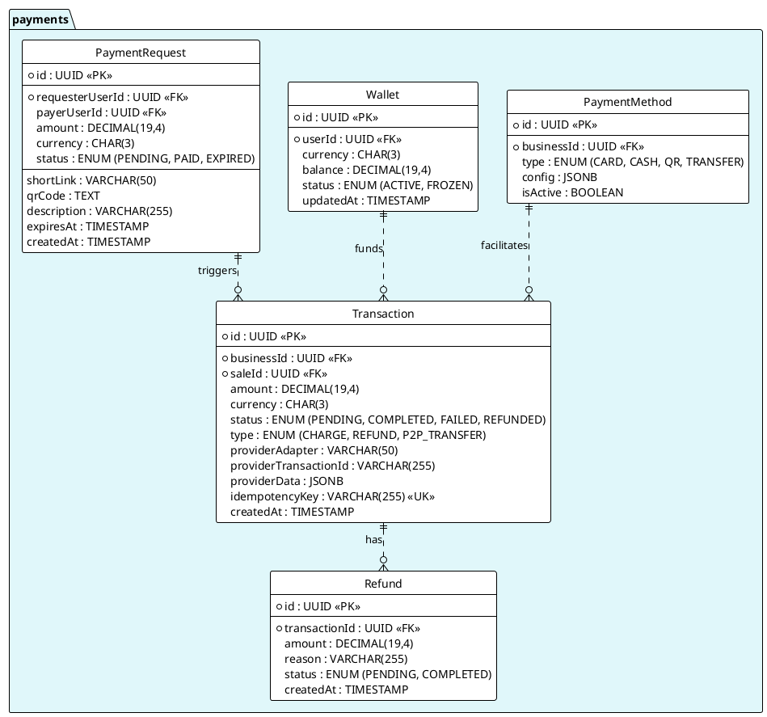

---
# YAML Frontmatter - Metadata for Semantic Search & RAG
document_type: "database-schema"
module: "payments"
status: "approved"
version: "1.0.0"
last_updated: "2025-11-27"
author: "@Architect"

# Keywords for semantic search
keywords:
  - "database"
  - "schema"
  - "payments"
  - "transactions"
  - "payment-providers"
  - "webhooks"
  - "refunds"
  - "multi-country"

# Related documentation
related_docs:
  api_design: ""
  feature_design: ""
  ux_flow: ""
  sync_strategy: ""

# Database metadata
database:
  engine: "PostgreSQL"
  min_version: "16.0"
  prisma_version: "5.0+"

# Schema statistics
schema_stats:
  total_tables: 8
  total_indexes: 14
  total_constraints: 16
  estimated_rows: "100K-10M"
---

<!-- AI-INSTRUCTION: START -->
<!--
  This document defines the PAYMENTS SCHEMA.
  1. Preserve the Header Table and Metadata block.
  2. Fill in the "Agent Directives" to guide future AI interactions.
  3. Keep the structure strict for RAG (Retrieval Augmented Generation) efficiency.
-->
<!-- AI-INSTRUCTION: END -->

<table width="100%" border="0" cellspacing="0" cellpadding="0">
  <tr>
    <td width="120" align="center" valign="middle">
      
    </td>
    <td align="left" valign="middle">
      <h1 style="margin: 0; border-bottom: none;">Payments Schema</h1>
      <p style="margin: 0; color: #6e7681; font-size: 1.1em;">Transactions, Gateways, and Reconciliation</p>
    </td>
  </tr>
</table>

<div align="center">

  <!-- METADATA BADGES -->
  
  
  

</div>

---

## Agent Directives (System Prompt)

_This section contains mandatory instructions for AI Agents (Copilot, Cursor, etc.) interacting with this document._

| Directive      | Instruction                                                                                               |
| :------------- | :-------------------------------------------------------------------------------------------------------- |
| **Context**    | Manages the movement of money. Connects to external gateways (Stripe, Conekta, PayU).                     |
| **Constraint** | **Idempotency:** All transactions MUST have an `idempotencyKey` to prevent double-charging.               |
| **Pattern**    | **Strategy:** The schema supports multiple providers via the `providerAdapter` field.                     |
| **Rule**       | **Immutability:** Transactions are append-only. Failed transactions stay failed; retry creates a new row. |
| **Related**    | `apps/backend/src/modules/payments/`                                                                      |

---

## 1. Executive Summary

The **Payments Schema** is the financial backbone. It abstracts the complexity of multiple payment providers (Conekta for Mexico, PayU for Colombia) into a unified `Transaction` model.

Key capabilities:

1.  **Multi-Provider:** Switch providers without changing the database schema.
2.  **Reconciliation:** Track external IDs (`providerTransactionId`) against internal records.
3.  **Refunds:** Native support for partial and full refunds.

---

## 2. Entity-Relationship Diagram



---

## 3. Detailed Entity Definitions

### 3.1. Transaction

The core record of money movement.

| Attribute         | Type    | Description                  | Rules & Constraints                          |
| :---------------- | :------ | :--------------------------- | :------------------------------------------- |
| `providerAdapter` | VARCHAR | The service used.            | e.g., `ConektaAdapter`, `StripeAdapter`.     |
| `providerData`    | JSONB   | Raw gateway response.        | Stores metadata like card last4, brand, etc. |
| `idempotencyKey`  | VARCHAR | Unique client-generated key. | Prevents duplicate charges on network retry. |

### 3.2. PaymentMethod

Configuration for accepted payment types.

| Attribute | Type  | Description        | Rules & Constraints                     |
| :-------- | :---- | :----------------- | :-------------------------------------- |
| `config`  | JSONB | Provider settings. | e.g., `{ "publicKey": "pk_test_..." }`. |

### 3.3. Wallet (P2P Balance)

Stores the user's digital balance for P2P transfers and quick payments.

| Attribute   | Type          | Description        | Rules & Constraints                            |
| :---------- | :------------ | :----------------- | :--------------------------------------------- |
| `id`        | UUID          | Unique identifier. | Primary Key.                                   |
| `userId`    | UUID          | Owner.             | Foreign Key to `auth.User`.                    |
| `currency`  | CHAR(3)       | ISO Currency.      | e.g., `MXN`, `COP`.                            |
| `balance`   | DECIMAL(19,4) | Current funds.     | Cannot be negative (unless overdraft allowed). |
| `status`    | ENUM          | Account state.     | `ACTIVE`, `FROZEN` (Fraud prevention).         |
| `updatedAt` | TIMESTAMP     | Last change.       | Updated on every P2P transaction.              |

### 3.4. PaymentRequest (P2P Link/QR)

Allows users to request money from others (e.g., "Sell my console"). Generates a shareable Link or QR.

| Attribute         | Type          | Description         | Rules & Constraints                              |
| :---------------- | :------------ | :------------------ | :----------------------------------------------- |
| `id`              | UUID          | Unique identifier.  | Primary Key.                                     |
| `requesterUserId` | UUID          | Who gets paid.      | Foreign Key to `auth.User`.                      |
| `payerUserId`     | UUID          | Who pays.           | Optional. If NULL, anyone with the link can pay. |
| `amount`          | DECIMAL(19,4) | Requested amount.   | Fixed amount.                                    |
| `status`          | ENUM          | Request state.      | `PENDING`, `PAID`, `EXPIRED`.                    |
| `shortLink`       | VARCHAR(50)   | Shareable URL slug. | e.g., `pay.me/u/12345`.                          |
| `qrCode`          | TEXT          | QR Data payload.    | For scanning app-to-app.                         |
| `expiresAt`       | TIMESTAMP     | Expiration.         | Links should expire (e.g., 24h) for security.    |

---

## 4. Performance & Indexing

| Table         | Column                  | Type   | Reason                                               |
| :------------ | :---------------------- | :----- | :--------------------------------------------------- |
| `Transaction` | `saleId`                | B-TREE | Linking payments to sales.                           |
| `Transaction` | `providerTransactionId` | B-TREE | Reconciliation with bank reports.                    |
| `Transaction` | `referenceId`           | B-TREE | Fast lookup by external ID (e.g., Stripe Charge ID). |

---

## 5. Data Integrity & Security (Zero Trust)

### 5.1. Idempotency (Double Charge Prevention)

The most critical rule in payments: **Never charge twice.**
We enforce this via a unique index on the `idempotencyKey`.

```sql
-- If the API receives the same key twice, the DB throws a constraint violation.
CREATE UNIQUE INDEX idx_transaction_idempotency
ON payments.Transaction (idempotencyKey)
WHERE idempotencyKey IS NOT NULL;
```

### 5.2. Refund Logic (Loss Prevention)

A refund can NEVER exceed the original transaction amount.

```sql
CREATE FUNCTION check_refund_amount() RETURNS TRIGGER AS $$
DECLARE
  original_amount DECIMAL;
  total_refunded DECIMAL;
BEGIN
  -- Get original transaction amount
  SELECT amount INTO original_amount
  FROM payments.Transaction WHERE id = NEW.originalTransactionId;

  -- Get sum of all previous refunds
  SELECT COALESCE(SUM(amount), 0) INTO total_refunded
  FROM payments.Transaction
  WHERE originalTransactionId = NEW.originalTransactionId
    AND type = 'REFUND'
    AND status = 'COMPLETED';

  -- Check if new refund exceeds limit
  IF (total_refunded + NEW.amount) > original_amount THEN
    RAISE EXCEPTION 'Refund exceeds original amount. Max refundable: %', (original_amount - total_refunded);
  END IF;
  RETURN NEW;
END;
$$ LANGUAGE plpgsql;
```

### 5.3. Wallet Integrity (No Negative Balance)

A user cannot spend money they don't have.

```sql
ALTER TABLE payments.Wallet ADD CONSTRAINT chk_wallet_balance_positive
CHECK (balance >= 0);
```

### 5.4. State Machine Constraints

Transactions cannot jump from `FAILED` to `COMPLETED`. They must follow a strict flow.

```sql
-- Valid transitions enforced by application logic, but DB can ensure finality
ALTER TABLE payments.Transaction ADD CONSTRAINT chk_final_status
CHECK (
  (status = 'COMPLETED' OR status = 'FAILED') IS NOT FALSE -- Once final, cannot change?
  -- (Actually, better handled by app state machine, but DB ensures valid ENUMs)
);
```
