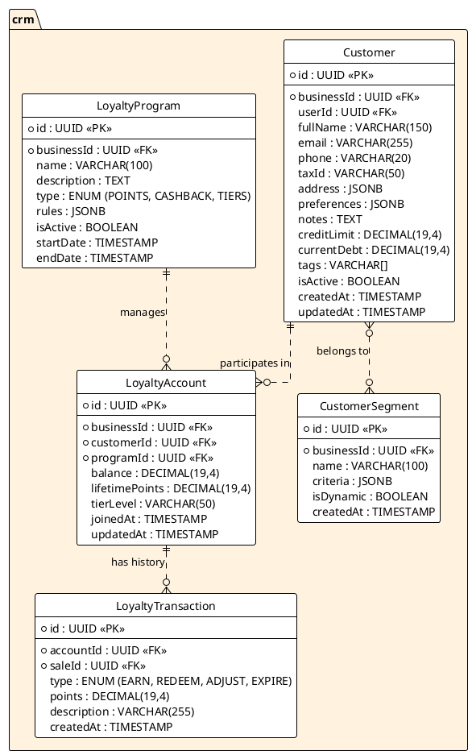

---
# YAML Frontmatter - Metadata for Semantic Search & RAG
document_type: "database-schema"
module: "crm"
status: "approved"
version: "1.0.0"
last_updated: "2025-12-05"
author: "@Architect"

# Keywords for semantic search
keywords:
  - "database"
  - "schema"
  - "crm"
  - "customers"
  - "loyalty"
  - "points"
  - "segments"
  - "rewards"

# Related documentation
related_docs:
  api_design: ""
  feature_design: "docs/technical/backend/features/LOYALTY-SYSTEM.md"
  ux_flow: "docs/technical/frontend/ux-flows/CUSTOMER-MANAGEMENT.md"
  sync_strategy: "docs/technical/architecture/OFFLINE-SYNC.md"

# Database metadata
database:
  engine: "PostgreSQL"
  min_version: "16.0"
  prisma_version: "5.0+"

# Schema statistics
schema_stats:
  total_tables: 5
  total_indexes: 12
  total_constraints: 15
  estimated_rows: "100K-1M"
---

<!-- AI-INSTRUCTION: START -->
<!--
  This document defines the CRM SCHEMA.
  1. Preserve the Header Table and Metadata block.
  2. Fill in the "Agent Directives" to guide future AI interactions.
  3. Keep the structure strict for RAG (Retrieval Augmented Generation) efficiency.
-->
<!-- AI-INSTRUCTION: END -->

<table width="100%" border="0" cellspacing="0" cellpadding="0">
  <tr>
    <td width="120" align="center" valign="middle">
      
    </td>
    <td align="left" valign="middle">
      <h1 style="margin: 0; border-bottom: none;">CRM Schema (Customers & Loyalty)</h1>
      <p style="margin: 0; color: #6e7681; font-size: 1.1em;">Customer Profiles, Loyalty Programs, and Segmentation</p>
    </td>
  </tr>
</table>

<div align="center">

  <!-- METADATA BADGES -->
  
  
  

</div>

---

## Agent Directives (System Prompt)

_This section contains mandatory instructions for AI Agents (Copilot, Cursor, etc.) interacting with this document._

| Directive      | Instruction                                                                                    |
| :------------- | :--------------------------------------------------------------------------------------------- |
| **Context**    | Manages customer data, loyalty points, and marketing segments.                                 |
| **Constraint** | **Multi-Tenancy:** All entities MUST be scoped by `businessId`.                                |
| **Pattern**    | **Loyalty:** Points are transactional. Never update balance without a `LoyaltyTransaction`.    |
| **Rule**       | **Privacy:** PII (Personally Identifiable Information) must be handled according to GDPR/CCPA. |
| **Related**    | `apps/backend/src/modules/crm/`                                                                |

---

## 1. Executive Summary

The **CRM Schema** is the central repository for customer data. It moves beyond simple contact info to track behavior, loyalty status, and engagement.

Key capabilities:

1.  **Unified Profile:** Single view of the customer across all channels (POS, Online).
2.  **Loyalty Engine:** Flexible point systems (e.g., "1 point per $10", "Double points on Tuesdays").
3.  **Segmentation:** Dynamic grouping of customers (e.g., "Big Spenders", "At Risk") for targeted actions.
4.  **Credit Management:** Tracks store credit and debt limits.

---

## 2. Entity-Relationship Diagram



---

## 3. Detailed Entity Definitions

### 3.1. Customer

Represents a client of the business. Can be a casual walk-in (unregistered) or a registered regular.

| Attribute     | Type          | Description          | Rules & Constraints                                   |
| :------------ | :------------ | :------------------- | :---------------------------------------------------- |
| `id`          | UUID          | Unique identifier.   | Primary Key.                                          |
| `businessId`  | UUID          | Tenant owner.        | Foreign Key to `business.Business`.                   |
| `userId`      | UUID          | Global Identity.     | Foreign Key to `auth.User`. Optional (for App users). |
| `fullName`    | VARCHAR(150)  | Client name.         | Required.                                             |
| `email`       | VARCHAR(255)  | Contact email.       | Optional. Used for digital receipts.                  |
| `phone`       | VARCHAR(20)   | Contact phone.       | Optional.                                             |
| `taxId`       | VARCHAR(50)   | Fiscal ID.           | RFC/NIT. Required for invoices.                       |
| `address`     | JSONB         | Billing/Shipping.    | `{ "street": "...", "zip": "..." }`.                  |
| `preferences` | JSONB         | Comm settings.       | `{ "receiptChannel": "WHATSAPP", "language": "es" }`. |
| `notes`       | TEXT          | Internal remarks.    | "Likes spicy food", "VIP".                            |
| `creditLimit` | DECIMAL(19,4) | Max allowed debt.    | For "Fiado" (Store Credit).                           |
| `currentDebt` | DECIMAL(19,4) | Outstanding balance. | Updated when sales are `UNPAID`.                      |
| `tags`        | VARCHAR[]     | Quick labels.        | e.g., `["VIP", "LOCAL"]`.                             |
| `isActive`    | BOOLEAN       | Status.              | Default `true`.                                       |
| `createdAt`   | TIMESTAMP     | Creation date.       | UTC.                                                  |

### 3.2. LoyaltyProgram

Defines the rules for a loyalty campaign.

| Attribute    | Type         | Description        | Rules & Constraints                                    |
| :----------- | :----------- | :----------------- | :----------------------------------------------------- |
| `id`         | UUID         | Unique identifier. | Primary Key.                                           |
| `businessId` | UUID         | Tenant owner.      | Foreign Key to `business.Business`.                    |
| `name`       | VARCHAR(100) | Program name.      | e.g., "Puntos Frecuentes 2025".                        |
| `type`       | ENUM         | Strategy.          | `POINTS` (Earn/Burn), `CASHBACK` (%), `TIERS` (Level). |
| `rules`      | JSONB        | Logic config.      | `{ "earnRate": 0.1, "minRedeem": 100 }`.               |
| `isActive`   | BOOLEAN      | Status.            | Only one active program per type usually allowed.      |
| `startDate`  | TIMESTAMP    | Validity start.    |                                                        |
| `endDate`    | TIMESTAMP    | Validity end.      | Optional (ongoing).                                    |

### 3.3. LoyaltyAccount

The link between a customer and a program, holding their balance.

| Attribute        | Type          | Description        | Rules & Constraints                          |
| :--------------- | :------------ | :----------------- | :------------------------------------------- |
| `id`             | UUID          | Unique identifier. | Primary Key.                                 |
| `businessId`     | UUID          | Tenant owner.      | Foreign Key to `business.Business`.          |
| `customerId`     | UUID          | The member.        | Foreign Key to `Customer`.                   |
| `programId`      | UUID          | The campaign.      | Foreign Key to `LoyaltyProgram`.             |
| `balance`        | DECIMAL(19,4) | Current points.    | Can be negative if allowed by rules (rare).  |
| `lifetimePoints` | DECIMAL(19,4) | Total earned.      | Used for Tier calculation (never decreases). |
| `tierLevel`      | VARCHAR(50)   | Current status.    | e.g., "GOLD", "PLATINUM".                    |
| `joinedAt`       | TIMESTAMP     | Enrollment date.   |                                              |

### 3.4. LoyaltyTransaction

An immutable record of every point change.

| Attribute     | Type          | Description        | Rules & Constraints                                 |
| :------------ | :------------ | :----------------- | :-------------------------------------------------- |
| `id`          | UUID          | Unique identifier. | Primary Key.                                        |
| `accountId`   | UUID          | The account.       | Foreign Key to `LoyaltyAccount`.                    |
| `saleId`      | UUID          | Context.           | Foreign Key to `sales.Sale`. Optional (if manual).  |
| `type`        | ENUM          | Action.            | `EARN` (+), `REDEEM` (-), `ADJUST` (+/-), `EXPIRE`. |
| `points`      | DECIMAL(19,4) | Amount.            | Positive or negative depending on type.             |
| `description` | VARCHAR(255)  | Reason.            | e.g., "Purchase #1024", "Birthday Bonus".           |
| `createdAt`   | TIMESTAMP     | Event time.        | UTC.                                                |

### 3.5. CustomerSegment

Dynamic or static groups of customers for marketing purposes.

| Attribute    | Type         | Description                 | Rules & Constraints                                |
| :----------- | :----------- | :-------------------------- | :------------------------------------------------- |
| `id`         | UUID         | Unique identifier.          | Primary Key.                                       |
| `businessId` | UUID         | The owner.                  | Foreign Key to `business.Business`.                |
| `name`       | VARCHAR(100) | Segment name.               | e.g., "Big Spenders", "Inactive > 90 days".        |
| `criteria`   | JSONB        | Logic for dynamic segments. | `{ "minSpend": 1000, "lastVisitDays": 30 }`.       |
| `isDynamic`  | BOOLEAN      | Auto-update flag.           | If `true`, calculated nightly. If `false`, manual. |
| `createdAt`  | TIMESTAMP    | Creation date.              |                                                    |

---

## 4. Performance & Indexing

| Table      | Column       | Type   | Reason                                   |
| :--------- | :----------- | :----- | :--------------------------------------- |
| `Customer` | `email`      | B-TREE | Fast lookup for login/receipts.          |
| `Customer` | `phone`      | B-TREE | Fast lookup at POS (common identifier).  |
| `Customer` | `taxId`      | B-TREE | Prevent duplicate fiscal entities.       |
| `Loyalty`  | `customerId` | B-TREE | Quickly show points balance at checkout. |

---

## 5. Data Integrity & Logic

### 5.1. Balance Consistency

The `LoyaltyAccount.balance` must always equal the sum of its `LoyaltyTransaction`s.

```sql
-- Conceptual Trigger
CREATE FUNCTION update_loyalty_balance() RETURNS TRIGGER AS $$
BEGIN
  UPDATE crm.LoyaltyAccount
  SET balance = balance + NEW.points,
      updatedAt = NOW()
  WHERE id = NEW.accountId;
  RETURN NEW;
END;
$$ LANGUAGE plpgsql;
```

### 5.2. Debt Protection

Customers cannot be deleted if they have outstanding debt.

```sql
CREATE FUNCTION check_customer_debt() RETURNS TRIGGER AS $$
BEGIN
  IF OLD.currentDebt > 0 THEN
    RAISE EXCEPTION 'Cannot delete customer with outstanding debt: %', OLD.currentDebt;
  END IF;
  RETURN OLD;
END;
$$ LANGUAGE plpgsql;
```

---

## 6. Example Data & Usage Scenarios

### 6.1. Customer (Regular)

```json
{
  "id": "cust_555",
  "businessId": "bus_123",
  "fullName": "Juan Perez",
  "email": "juan@example.com",
  "phone": "+525512345678",
  "taxId": "XAXX010101000",
  "tags": ["VIP", "LOCAL"],
  "creditLimit": 5000.0,
  "currentDebt": 0.0,
  "isActive": true
}
```

### 6.2. Loyalty Account (Points)

```json
{
  "id": "loy_acc_99",
  "customerId": "cust_555",
  "programId": "prog_points_2025",
  "balance": 150.0,
  "lifetimePoints": 1250.0,
  "tierLevel": "GOLD",
  "joinedAt": "2023-01-15T10:00:00Z"
}
```

## Appendix A: Change Log

| Date       | Version | Author     | Changes          |
| :--------- | :------ | :--------- | :--------------- |
| 2025-12-05 | 1.0.0   | @Architect | Initial creation |
