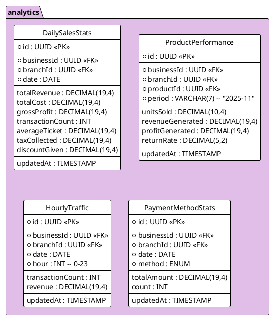

---
# YAML Frontmatter - Metadata for Semantic Search & RAG
document_type: "database-schema"
module: "analytics"
status: "approved"
version: "1.0.0"
last_updated: "2025-12-05"
author: "@Architect"

# Keywords for semantic search
keywords:
  - "database"
  - "schema"
  - "analytics"
  - "reporting"
  - "stats"
  - "dashboard"
  - "kpi"
  - "performance"

# Related documentation
related_docs:
  api_design: ""
  feature_design: "docs/technical/backend/features/REPORTING-ENGINE.md"
  ux_flow: "docs/technical/frontend/ux-flows/DASHBOARD.md"
  sync_strategy: ""

# Database metadata
database:
  engine: "PostgreSQL"
  min_version: "16.0"
  prisma_version: "5.0+"

# Schema statistics
schema_stats:
  total_tables: 4
  total_indexes: 8
  total_constraints: 4
  estimated_rows: "1M-100M"
---

<!-- AI-INSTRUCTION: START -->
<!--
  This document defines the ANALYTICS SCHEMA.
  1. Preserve the Header Table and Metadata block.
  2. Fill in the "Agent Directives" to guide future AI interactions.
  3. Keep the structure strict for RAG (Retrieval Augmented Generation) efficiency.
-->
<!-- AI-INSTRUCTION: END -->

<table width="100%" border="0" cellspacing="0" cellpadding="0">
  <tr>
    <td width="120" align="center" valign="middle">
      
    </td>
    <td align="left" valign="middle">
      <h1 style="margin: 0; border-bottom: none;">Analytics Schema (Reporting)</h1>
      <p style="margin: 0; color: #6e7681; font-size: 1.1em;">Aggregated Stats, KPIs, and Performance Metrics</p>
    </td>
  </tr>
</table>

<div align="center">

  <!-- METADATA BADGES -->
  
  
  

</div>

---

## Agent Directives (System Prompt)

_This section contains mandatory instructions for AI Agents (Copilot, Cursor, etc.) interacting with this document._

| Directive      | Instruction                                                                                       |
| :------------- | :------------------------------------------------------------------------------------------------ |
| **Context**    | Stores pre-calculated aggregations to speed up dashboard loading and reporting.                   |
| **Constraint** | **Read-Only:** These tables are populated by background jobs, NOT by direct user action.          |
| **Pattern**    | **Materialized View:** Data is eventually consistent (e.g., updated every 5-15 minutes).          |
| **Rule**       | **Retention:** Granular data (hourly) may be archived after 1 year; daily data is kept forever.   |
| **Related**    | `apps/backend/src/modules/analytics/`                                                             |

---

## 1. Executive Summary

The **Analytics Schema** is designed for **OLAP (Online Analytical Processing)** workloads. Instead of querying millions of `Sale` rows to get "Total Revenue Today", the dashboard queries `DailySalesStats`.

Key capabilities:

1.  **Instant Dashboards:** Sub-second response times for KPIs.
2.  **Trend Analysis:** Easy comparison of "This Month vs Last Month".
3.  **Product Insights:** Identifying best sellers and dead stock.
4.  **Staff Performance:** Tracking sales per employee.

---

## 2. Entity-Relationship Diagram



---

## 3. Detailed Entity Definitions

### 3.1. DailySalesStats

The "Heartbeat" of the business. One row per branch per day.

| Attribute          | Type          | Description        | Rules & Constraints                                  |
| :----------------- | :------------ | :----------------- | :--------------------------------------------------- |
| `id`               | UUID          | Unique identifier. | Primary Key.                                         |
| `businessId`       | UUID          | Tenant owner.      | Foreign Key to `business.Business`.                  |
| `branchId`         | UUID          | Location.          | Foreign Key to `business.Branch`.                    |
| `date`             | DATE          | The day.           | Unique Constraint `(branchId, date)`.                |
| `totalRevenue`     | DECIMAL(19,4) | Sales total.       | Sum of `Sale.total` (Completed only).                |
| `totalCost`        | DECIMAL(19,4) | COGS.              | Sum of `SaleItem.cost * quantity`.                   |
| `grossProfit`      | DECIMAL(19,4) | Margin.            | `totalRevenue - totalCost`.                          |
| `transactionCount` | INT           | Volume.            | Number of sales.                                     |
| `averageTicket`    | DECIMAL(19,4) | KPI.               | `totalRevenue / transactionCount`.                   |
| `updatedAt`        | TIMESTAMP     | Last calc.         |                                                      |

### 3.2. ProductPerformance

Used for the "Top Products" report and inventory planning. Aggregated monthly.

| Attribute          | Type          | Description        | Rules & Constraints                                  |
| :----------------- | :------------ | :----------------- | :--------------------------------------------------- |
| `id`               | UUID          | Unique identifier. | Primary Key.                                         |
| `businessId`       | UUID          | Tenant owner.      | Foreign Key to `business.Business`.                  |
| `productId`        | UUID          | The item.          | Foreign Key to `inventory.Product`.                  |
| `period`           | VARCHAR(7)    | Month.             | Format `YYYY-MM`.                                    |
| `unitsSold`        | DECIMAL(10,4) | Velocity.          | Total quantity sold.                                 |
| `revenueGenerated` | DECIMAL(19,4) | Sales.             | Total revenue from this product.                     |
| `profitGenerated`  | DECIMAL(19,4) | Profit.            | Revenue - Cost.                                      |

### 3.3. HourlyTraffic

Used for "Heatmaps" to help managers schedule staff during peak hours.

| Attribute          | Type          | Description        | Rules & Constraints                                  |
| :----------------- | :------------ | :----------------- | :--------------------------------------------------- |
| `id`               | UUID          | Unique identifier. | Primary Key.                                         |
| `date`             | DATE          | The day.           |                                                      |
| `hour`             | INT           | Time slot.         | 0 to 23.                                             |
| `transactionCount` | INT           | Busy-ness.         | Number of sales in this hour.                        |

### 3.4. PaymentMethodStats

Tracks how customers are paying (Cash vs Card vs Transfer).

| Attribute     | Type          | Description        | Rules & Constraints                                  |
| :------------ | :------------ | :----------------- | :--------------------------------------------------- |
| `id`          | UUID          | Unique identifier. | Primary Key.                                         |
| `businessId`  | UUID          | Tenant owner.      | Foreign Key to `business.Business`.                  |
| `branchId`    | UUID          | Location.          | Foreign Key to `business.Branch`.                    |
| `date`        | DATE          | The day.           |                                                      |
| `method`      | ENUM          | Payment type.      | `CASH`, `CARD`, `TRANSFER`, `OTHER`.                 |
| `totalAmount` | DECIMAL(19,4) | Sum of payments.   |                                                      |
| `count`       | INT           | Number of txns.    |                                                      |
| `updatedAt`   | TIMESTAMP     | Last calc.         |                                                      |

---

## 4. Performance & Indexing

| Table             | Column              | Type   | Reason                                     |
| :---------------- | :------------------ | :----- | :----------------------------------------- |
| `DailySalesStats` | `(businessId, date)`| B-TREE | Fast range queries for "Last 30 Days".     |
| `ProductStats`    | `(period, revenue)` | B-TREE | Fast sorting for "Top Selling Products".   |

---

## 5. Data Integrity & Logic

### 5.1. Idempotency

The aggregation jobs must be idempotent. Running the calculation for "Yesterday" twice should result in the same numbers, not double.

### 5.2. Timezones

All dates in `DailySalesStats` are stored based on the **Branch's Timezone**, not UTC. This ensures that "Monday Sales" matches what the store manager considers "Monday".

---

## 6. Example Data & Usage Scenarios

### 6.1. Daily Sales Stats (Report)
```json
{
  "id": "stats_20231027_br1",
  "businessId": "bus_123",
  "branchId": "br_centro",
  "date": "2023-10-27",
  "totalRevenue": 15000.00,
  "totalCost": 8000.00,
  "grossProfit": 7000.00,
  "transactionCount": 150,
  "averageTicket": 100.00,
  "updatedAt": "2023-10-28T02:00:00Z"
}
```

### 6.2. Product Performance (Top Seller)
```json
{
  "id": "perf_coke_oct",
  "productId": "prod_coke",
  "period": "2023-10",
  "unitsSold": 500,
  "revenueGenerated": 9000.00,
  "profitGenerated": 2750.00
}
```

## Appendix A: Change Log

| Date       | Version | Author      | Changes          |
| :--------- | :------ | :---------- | :--------------- |
| 2025-12-05 | 1.0.0   | @Architect  | Initial creation |
